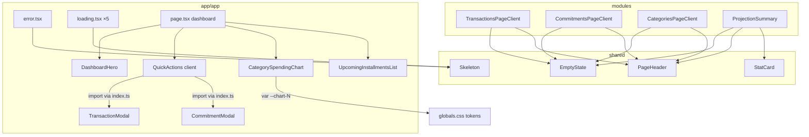

# app-polish — Design

**Spec**: `.specs/features/app-polish/spec.md`
**Status**: Approved (2026-07-24)

Decisões do usuário que constrangem este design (entrevista 2026-07-24): reestruturar dentro do canon; estados completos (loading/erro/vazio); atalhos de criação no dashboard **via modais compostos** (confirmado na exploração de abordagens — deep-link `?new=1` descartado por tirar o usuário do dashboard e enfraquecer POLISH-08).

Constraints ativas relevantes: AD-004 (shadcn/Recharts), AD-008 (Money/formatBRL via `shared`), AD-010 (fronteiras: `app/` importa de todos; módulos só via `index.ts`; `shared` ← todos), AD-016 (agregações via API pública), AD-017 (DESIGN.md é autoridade; tokens de `globals.css` são a única fonte de cor).

---

## Architecture Overview

Três camadas de mudança, da fundação para as páginas:

1. **Primitivos em `shared`** — `EmptyState`, `Skeleton`, `StatCard`, `PageHeader` entram em `src/shared/components/ui` e saem pela API pública. São a base dos estados consistentes (POLISH-01..05) e da hierarquia comum (POLISH-12). A paleta do gráfico vira tokens `--chart-1..8` em `globals.css` (claro + escuro).
2. **Estados por rota em `app/`** — `loading.tsx` por rota (5×, compondo `Skeleton` na forma da página real) e um `src/app/app/error.tsx` compartilhado (client component com `reset()`).
3. **Páginas** — dashboard reestruturado (herói + atalhos + cards) e polish in-situ dos componentes dos 4 módulos, que passam a consumir os primitivos de `shared`.

Fluxo do atalho: usuário clica "+ Nova transação" → `QuickActions` abre `TransactionModal` (categorias já buscadas pelo `page.tsx` server-side via `listCategoriesByUser`) → sucesso → `router.refresh()` → números do dashboard re-renderizam (POLISH-08).

---

## Code Reuse Analysis

### Existing Components to Leverage

| Component | Location | How to Use |
| --------- | -------- | ---------- |
| `Card`, `Button`, `Dialog`, `Select`, `Input`, `Label`, `Progress`, `Separator` | `src/shared/components/ui` | Base de todos os polishes; `Progress` para quitação de compromissos (POLISH-14) |
| `formatBRL`, `money` | `src/shared/money` | Única formatação BRL (AD-008); herói e StatCards |
| `TransactionModal` | `src/modules/transactions/components` | Reexportar em `index.ts`; consumido por `QuickActions` (contrato: `{categories, transaction?, open, onOpenChange, onSuccess}`) |
| `CommitmentModal` | `src/modules/commitments/components` | Reexportar em `index.ts` (contrato: `{isOpen, onClose, editingCommitment?, categories, onSuccess?}`) |
| `listCategoriesByUser` | `@/modules/categories` | Dashboard passa a buscá-la no `Promise.all` para alimentar os modais |
| `ProjectionSummary` | `src/modules/projections` | Refatorada sobre `StatCard`; segue usada por projeções; dashboard usa `StatCard` direto (3 stats, saldo vai pro herói) |
| Padrão `app-shell.tsx` | `src/app/app/_components` | Referência de idiom (tokens, aria, foco) para os novos componentes |
| Paleta categórica validada | `CategorySpendingChart.tsx` | Migra para tokens `--chart-1..8` (claro); variantes escuras derivadas na execução com a skill dataviz |

### Integration Points

| System | Integration Method |
| ------ | ------------------ |
| Fronteiras AD-010 | `EmptyState`/`PageHeader`/`StatCard`/`Skeleton` em `shared` (importável por todos); modais expostos via `index.ts` dos módulos donos; nenhuma dependência nova entre módulos |
| Server actions existentes | Intocadas — modais compostos reusam `create*Action` dos módulos donos |
| `theme-contrast.test.ts` | Ganha os pares texto/fundo novos que os primitivos introduzirem (POLISH-19) |
| Suítes e2e | Gate de regressão; helpers de `dashboard.spec.ts` que clicam "Nova transação"/"Novo Compromisso" nas páginas dos módulos são atualizados junto com qualquer mudança de accessible name (ver Risks) |

---

## Components

### EmptyState (novo)

- **Purpose**: Estado vazio único para todas as listas/cards (POLISH-03).
- **Location**: `src/shared/components/ui/empty-state.tsx` (export via `src/shared/index.ts`)
- **Interfaces**: `EmptyState({ icon?: LucideIcon, title: string, description?: string, action?: ReactNode })`
- **Dependencies**: lucide-react, tokens.
- **Reuses**: substitui `TransactionsEmptyState`/`CommitmentsEmptyState` (que viram chamadas finas ou somem) e os vazios ad-hoc do dashboard/categorias.

### Skeleton (novo)

- **Purpose**: Bloco de loading (`bg-muted` + `animate-pulse`) para os `loading.tsx` (POLISH-01).
- **Location**: `src/shared/components/ui/skeleton.tsx`
- **Interfaces**: `Skeleton({ className?: string })` — padrão shadcn.
- **Reuses**: convenção shadcn vendored (AD-004).

### StatCard (novo)

- **Purpose**: Card de estatística com rótulo Label + valor tabular, tom semântico correto (POLISH-11/13; corrige `text-blue-600` do Total Comprometido — DESIGN.md define comprometido na cor Saída).
- **Location**: `src/shared/components/ui/stat-card.tsx`
- **Interfaces**: `StatCard({ label: string, value: Money, tone?: "neutral" | "entrada" | "saida" })` — formata via `formatBRL`, `tabular-nums`.
- **Reuses**: `Card`, helpers de `shared` (AD-008).

### PageHeader (novo)

- **Purpose**: Cabeçalho consistente (Headline + slot de ação primária) nas 4 páginas de dados (POLISH-12).
- **Location**: `src/shared/components/ui/page-header.tsx`
- **Interfaces**: `PageHeader({ title: string, description?: string, action?: ReactNode })`

### Chart tokens + CategorySpendingChart (refactor)

- **Purpose**: Paleta do gráfico como tokens (`--chart-1..8` em `:root` e `.dark`), gráfico referencia `var(--chart-N)`; vazio do gráfico via `EmptyState`; textos de tooltip/legenda via tokens (POLISH-09).
- **Location**: `src/app/globals.css` + `src/app/app/_components/CategorySpendingChart.tsx`
- **Reuses**: paleta clara já validada pela dataviz; variantes escuras derivadas na execução (dataviz de novo) — cores de fatia são não-texto (sem exigência AA 4.5:1; distinguibilidade CVD mantida).

### DashboardHero (novo)

- **Purpose**: Saldo projetado do mês como número-herói Display tabular, saudação secundária, cor semântica no negativo (POLISH-05/06).
- **Location**: `src/app/app/_components/DashboardHero.tsx` (server-renderável, puro)
- **Interfaces**: `DashboardHero({ userName: string, month: string, saldoProjetado: Money })`
- **Reuses**: `formatBRL`; tipografia Display do DESIGN.md.

### QuickActions (novo, client)

- **Purpose**: Botões "+ Nova transação" / "+ Novo compromisso" + os dois modais compostos; `router.refresh()` no sucesso (POLISH-07/08).
- **Location**: `src/app/app/_components/QuickActions.tsx`
- **Interfaces**: `QuickActions({ categories: Category[] })` — estado interno `openModal: "transaction" | "commitment" | null`.
- **Dependencies**: `TransactionModal`, `CommitmentModal` (novos exports públicos), `useRouter`.

### error.tsx (novo) e loading.tsx ×5 (novos)

- **Purpose**: Boundary compartilhado (`"use client"`, mensagem pt-BR calma, botão "Tentar novamente" → `reset()`) cobrindo todas as sub-rotas; skeletons por rota aproximando a forma real (herói+cards no dashboard; header+lista nas demais) (POLISH-01/02).
- **Location**: `src/app/app/error.tsx`; `src/app/app/{,transactions/,commitments/,categories/,projections/}loading.tsx`

### Polish in-situ das páginas (refactors, sem mudança de contrato)

- **Transações**: `PageHeader`; `TransactionList` com colunas alinhadas (valores tabulares à direita, cores semânticas só no valor); `Pagination` e modais/diálogos no DS; `EmptyState`; remover prop `total` não usada (ou exibi-la — decisão na execução).
- **Compromissos**: `PageHeader`; `CommitmentList` com progresso de quitação legível via `Progress` (POLISH-14); estados de parcela dentro das regras semânticas; `EmptyState`; modais no DS.
- **Categorias**: `PageHeader`; `CategorySection`/`CreateCategoryForm`/`DeleteCategoryDialog` tokenizados e alinhados.
- **Projeções**: `PageHeader` + `MonthNavigator` no DS; `ProjectionSummary` refatorada sobre `StatCard` (mantém os 4 stats na página de projeções) (POLISH-15).
- Todas: grep de paleta hardcoded zerado (POLISH-04), 320px sem overflow (POLISH-17/18), teclado + foco (POLISH-20).

---

## Data Models

Nenhum modelo novo — feature de apresentação e estados; schemas, repositórios e actions intocados.

---

## Error Handling Strategy

| Error Scenario | Handling | User Impact |
| -------------- | -------- | ----------- |
| Erro não tratado em qualquer página de `/app` (ex.: PostgreSQL indisponível) | `src/app/app/error.tsx` captura; log server-side default do Next | Mensagem pt-BR calma + "Tentar novamente" (`reset()`); shell permanece visível (boundary é filho do layout) |
| Falha em mutação nos modais (validação/action) | Comportamento existente dos módulos preservado (mensagens inline nos forms) | Igual ao atual, com estilo alinhado ao DS |
| Carregamento lento | `loading.tsx` da rota | Skeleton na forma da página, sem layout shift grosseiro |

---

## Risks & Concerns

| Concern | Location | Impact | Mitigation |
| ------- | -------- | ------ | ---------- |
| Helpers do e2e clicam "Nova transação"/"Novo Compromisso" e asserts de texto (`✓ Paga`, `Nenhum gasto neste mês`) — copy polish quebra seletores (lição do timeout de projections: seletores desatualizados, não infra) | `e2e/dashboard.spec.ts:48,75,172-229`; demais specs | e2e vermelho por seletor órfão | Toda task que mudar accessible name/copy atualiza os seletores no MESMO commit; normalização de caixa ("Novo compromisso") incluída |
| Dois modais no dashboard + botão "Nova transação" também presente na página de transações | `QuickActions` | Ambiguidade de seletor em e2e novos; dois dialogs no mesmo DOM | e2e novos escopam por `getByRole("dialog")` + heading; `QuickActions` monta um modal por vez (`openModal` único) |
| `ProjectionSummary` compartilhada entre dashboard e projeções — reestruturar o dashboard não pode quebrar projeções | `src/modules/projections/components/ProjectionSummary.tsx` | Regressão em /app/projections | Refactor sobre `StatCard` mantém contrato (`{projection}`); e2e de projections como gate |
| Paleta hex hardcoded no gráfico + `text-blue-600` no Total Comprometido violam AD-017/Acento Raro | `CategorySpendingChart.tsx:10-19`; `ProjectionSummary.tsx:37` | Inconsistência de identidade; dark theme com cores não calibradas | Tokens `--chart-N` (claro+escuro via dataviz); StatCard tone `saida` para comprometido |
| `total` prop com `eslint-disable no-unused-vars` | `TransactionsPageClient.tsx:28-29` | Débito menor | Resolvido no polish da página (usar ou remover) |
| Skeletons que não aproximam a forma real causam layout shift | `loading.tsx` novos | CLS perceptível | Skeleton por rota espelha o layout real (herói+grid no dashboard; header+linhas nas listas) |

---

## Tech Decisions (only non-obvious ones)

| Decision | Choice | Rationale |
| -------- | ------ | --------- |
| Mecanismo dos atalhos | Modais compostos no dashboard (usuário confirmou) | Usuário não sai do contexto; POLISH-08 literal; custo = 2 exports + 1 fetch |
| Cores de gráfico | Tokens `--chart-1..8` em `globals.css`, referenciados via `var()` | Única forma de conformar AD-017 mantendo a paleta validada; **vira AD-018 (convenção de projeto)** na aprovação deste design |
| Total Comprometido | Cor semântica Saída (não azul) | DESIGN.md define "Saída / comprometido / negativo" como uma única semântica; azul é Acento Raro |
| Saldo no dashboard vs projeções | Dashboard: herói (Display) + 3 StatCards; Projeções: 4 StatCards via `ProjectionSummary` | Um número-herói por viewport (DESIGN.md); projeções é tabela de planejamento, sem herói |
| Empty states dos módulos | Componentes locais substituídos pelo `EmptyState` de `shared` | `shared` ← todos (AD-010); consistência POLISH-03 sem duplicação |
| `error.tsx` único no segmento `/app` | Um boundary cobre todas as sub-rotas | Next.js propaga ao boundary pai; 5 cópias sem ganho |
