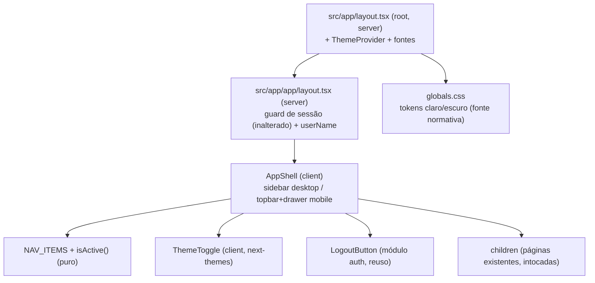

# App Shell + Fundação de Design — Design

**Spec**: `.specs/features/app-shell/spec.md`
**Status**: Draft

---

## Architecture Overview

O shell monta no layout já existente da área logada (`src/app/app/layout.tsx`), que hoje só faz o guard de sessão. O layout (server component) resolve a sessão, extrai o nome do usuário e compõe: skip link → `AppShell` (client) → conteúdo. O tema é global: `ThemeProvider` (next-themes) entra no root layout (`src/app/layout.tsx`), aplicando a classe `dark` no `<html>` antes do primeiro paint; o controle de tema vive dentro do shell.

Decisões visuais (paleta, contraste, tipografia) obedecem a `DESIGN.md` (seed) — canon da categoria no nível YNAB/Monarch, estratégia de cor contida, números tabulares.

## Approaches considered

1. **next-themes + classe `dark` (recomendada)** — biblioteca padrão do ecossistema App Router; script inline pré-hidratação elimina flash (SHELL-20); `defaultTheme="system"` + `enableSystem` cobre SHELL-18; persistência em localStorage cobre SHELL-19/20. Custo: 1 dependência pequena; `suppressHydrationWarning` no `<html>`.
2. **Cookie próprio + script manual** — zero dependências, tema legível no server (sem hydration mismatch); porém reimplementa listener de `prefers-color-scheme`, sincronização entre abas e o script anti-FOUC — código próprio a manter para resolver o que a opção 1 já resolve.
3. **Só CSS `prefers-color-scheme`** — não atende SHELL-19 (toggle) — descartada.

## Code Reuse Analysis

### Existing Components to Leverage

| Component | Location | How to Use |
| --------- | -------- | ---------- |
| Guard de sessão | `src/app/app/layout.tsx` | Manter intacto; só compor o shell em volta de `children` |
| `LogoutButton` | `src/modules/auth` (API pública) | Import direto no shell (SHELL-06) |
| `auth.api.getSession` | `src/modules/auth` | Já chamado no layout; passa `session.user.name` ao shell (SHELL-05) |
| `Button`, `Separator` | `src/shared/components/ui` | Compor toggle e itens do shell |
| Tokens shadcn/Tailwind v4 | `src/app/globals.css` | Retrabalhados: paleta Prumo claro/escuro; variante `dark` já configurada (`@custom-variant dark`) |
| Fontes Geist (next/font) | `src/app/layout.tsx` | Manter (workhorse, já carregada); ativar `tabular-nums` para valores — validar suporte no build; DESIGN.md marca a face como provisória |

### Integration Points

| System | Integration Method |
| ------ | ------------------ |
| next-themes (novo) | `ThemeProvider attribute="class"` no root layout; `useTheme()` no toggle |
| shadcn/ui Sheet (novo primitivo) | `npx shadcn add sheet` → `src/shared/components/ui/sheet.tsx`; base do drawer mobile |
| Módulos de domínio | Nenhum alterado; fronteiras AD-010 intactas (`app/` importa só APIs públicas) |

---

## Components

### AppShell

- **Purpose**: Casca de navegação da área logada — sidebar fixa (≥lg) e topbar+drawer (<lg).
- **Location**: `src/app/app/_components/app-shell.tsx` (client component)
- **Interfaces**: `AppShell({ userName, children })`
- **Dependencies**: `usePathname()`, `NAV_ITEMS`, `isActive`, `ThemeToggle`, `LogoutButton`, `Sheet`
- **Reuses**: primitivas de `shared`, `LogoutButton` do auth

### Config de navegação + isActive

- **Purpose**: Fonte única dos itens (label, href, exact) e lógica pura de item ativo (SHELL-03).
- **Location**: `src/app/app/_lib/nav.ts` (+ `__tests__/nav.test.ts`)
- **Interfaces**: `NAV_ITEMS: NavItem[]`; `isActive(pathname: string, item: NavItem): boolean` — match exato para `/app`, prefixo (`href` ou `href/…`) para seções
- **Dependencies**: nenhuma (TypeScript puro, unit-testável)

### ThemeProvider + ThemeToggle

- **Purpose**: Tema claro/escuro/sistema sem flash (SHELL-18..21).
- **Location**: provider em `src/app/providers.tsx` (usado no root layout); toggle em `src/app/app/_components/theme-toggle.tsx`
- **Interfaces**: toggle de 3 estados (claro/escuro/sistema) com rótulo acessível e estado ativo exposto (`aria-pressed`/`role="radiogroup"` — decidir na implementação)
- **Dependencies**: `next-themes`
- **Reuses**: `Button`/`DropdownMenu` ou `RadioGroup` de `shared`

### Tokens de tema (globals.css)

- **Purpose**: Paleta Prumo claro/escuro como única fonte de cor (SHELL-13/14); primeira materialização do DESIGN.md.
- **Location**: `src/app/globals.css` (`:root` + `.dark`)
- **Interfaces**: variáveis shadcn existentes (`--background`, `--primary`, …) — nomes mantidos, valores novos; páginas existentes herdam sem mudança de código
- **Dependencies**: validação de contraste AA par a par (claro e escuro)

### Layout da área logada (alterado)

- **Purpose**: Compor skip link + `AppShell` mantendo o guard (SHELL-07, SHELL-16).
- **Location**: `src/app/app/layout.tsx`
- **Reuses**: guard atual inalterado

---

## Error Handling Strategy

| Error Scenario | Handling | User Impact |
| -------------- | -------- | ----------- |
| Sessão ausente/expirada | Guard existente redireciona a `/login` (inalterado) | Igual ao comportamento atual |
| JS não hidratado | Links são `<a>` nativos (`next/link`); drawer indisponível até hidratar | Navegação desktop funciona sempre; mobile ganha o menu à hidratação |
| localStorage indisponível | next-themes cai para o tema do sistema | Tema correto, sem persistência |

---

## Risks & Concerns

| Concern | Location | Impact | Mitigation |
| ------- | -------- | ------ | ---------- |
| Páginas internas construídas light-only com classes `dark:` parciais — ativar dark mode global pode expor telas quebradas no escuro | ex.: `src/app/page.tsx:14` (`dark:bg-black`), páginas em `src/app/app/*` | Tela ilegível no tema escuro | Tokens dark bem calibrados cobrem a maioria (páginas usam variáveis shadcn); task dedicada de auditoria rápida no escuro corrige só ilegibilidade; polish completo fica no item 9 (`app-polish`) |
| Suítes E2E existentes (22 testes) dependem de seletores/estrutura das páginas; o shell muda a árvore de acessibilidade (novo `nav`, possivelmente dois botões "Sair") | `e2e/*.spec.ts` | Falhas de seletor em cascata (lição do projeto: timeouts de e2e eram seletores desatualizados) | Rodar a suíte E2E completa no gate de cada task de UI; ajustar seletores por role/nome acessível; garantir unicidade do "Sair" (o do dashboard será removido em favor do shell, ou escopado) |
| `next-themes` + SSR: `<html>` recebe classe no client → hydration mismatch sem `suppressHydrationWarning` | `src/app/layout.tsx` | Warning/flash | Aplicar `suppressHydrationWarning` no `<html>` (padrão documentado da lib) |
| Contraste AA nos dois temas não se auto-verifica | `globals.css` | SHELL-14 reprovável na validação | Task de verificação de contraste par a par (script/ferramenta) antes do gate |

---

## Tech Decisions (only non-obvious ones)

| Decision | Choice | Rationale |
| -------- | ------ | --------- |
| Mecanismo de tema | `next-themes` (approach 1) | Resolve FOUC, sistema, persistência e sync entre abas com API estável; custo de dependência mínimo |
| Breakpoint do shell | `lg` (1024px) | Assumption da spec confirmada pelo conteúdo denso (tabelas) |
| Drawer mobile | shadcn `Sheet` | Primitivo acessível (foco, Esc, overlay) — cobre SHELL-11 sem código próprio |
| Fonte | Manter Geist com `tabular-nums` (provisório) | Workhorse já carregada; DESIGN.md exige numerais tabulares — validar no build; troca só se falhar |
| Logout duplicado | Remover o `LogoutButton` da página do dashboard (shell passa a ser o dono) | Evita dois "Sair" na mesma tela (a11y + seletores E2E) |

> **Project-level decision registrada**: AD-017 em `.specs/STATE.md` — PRODUCT.md/DESIGN.md como autoridade de design de toda feature de UI.
