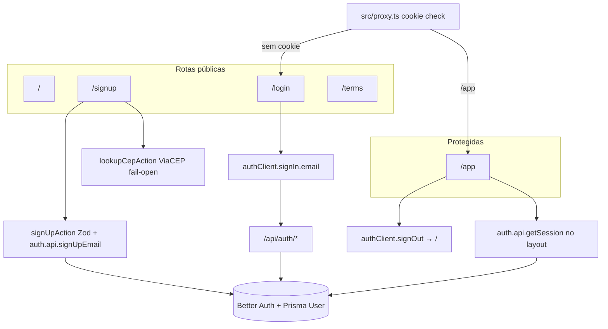

# Auth Design

**Spec**: `.specs/features/auth/spec.md`
**Context**: `.specs/features/auth/context.md`
**Status**: Approved
**Approach**: A — `additionalFields` no User + signup via Better Auth (confirmada pelo usuário)

---

## Architecture Overview

Cadastro, login, sessão e logout por cima do Better Auth já instalado no setup. O perfil cadastral (nascimento, CPF, endereço, aceite de termos) vive como `user.additionalFields` no model `User` — um único `auth.api.signUpEmail` persiste credenciais + perfil (atomicidade do adapter). A UI chama server actions do módulo `auth` (validação Zod na fronteira, AD-003); login/logout no client usam `authClient` tipado. Rotas protegidas: `proxy.ts` faz redirect otimista por cookie; o layout de `/app` valida a sessão de verdade com `getSession`.



---

## Code Reuse Analysis

### Existing Components to Leverage

| Component | Location | How to Use |
| --------- | -------- | ---------- |
| Instância Better Auth | `src/modules/auth/domain/auth.ts` | Estender com `user.additionalFields` + `emailAndPassword.minPasswordLength: 8` |
| Handler catch-all | `src/app/api/auth/[...all]/route.ts` | Sem mudança; continua `toNextJsHandler(auth)` |
| Prisma client | `src/shared/db.ts` | Já usado pelo adapter; migrations novas no mesmo schema |
| Env validado | `src/shared/env.ts` | Sem novas env vars (ViaCEP é público) |
| Card / tokens UI | `src/shared/components/ui/card.tsx` | Páginas de auth reusam o visual base; adicionar Input/Label/Button/Checkbox via shadcn |
| Fronteiras ESLint | `eslint.config.mjs` | `app` → `auth` só via `index.ts`; sem mudança de grafo |
| Pirâmide de testes | Vitest projects + Playwright | Unit em `domain/`; integração em `actions/`/`data/`; E2E novo fluxo |

### Integration Points

| System | Integration Method |
| ------ | ------------------ |
| Better Auth | `additionalFields` + `auth.api.signUpEmail` / `getSession` / client `signIn`/`signOut` |
| Prisma / PostgreSQL | Campos novos no `User` + `@@unique([cpf])` manual; migration |
| ViaCEP | `GET https://viacep.com.br/ws/{cep}/json/` via server action com timeout |
| Next.js 16 proxy | `src/proxy.ts` (AD-013) — matcher `/app`, `/login`, `/signup` |

---

## Components

### 1. Auth config estendida (AUTH-04, AUTH-10)

- **Purpose**: Declarar campos de perfil e política mínima de senha no Better Auth.
- **Location**: `src/modules/auth/domain/auth.ts`
- **Interfaces**:
  - `user.additionalFields` (todos `required: true`, `input: true`, exceto onde notado):
    - `cpf: { type: "string" }` — 11 dígitos normalizados
    - `birthDate: { type: "string" }` — `YYYY-MM-DD` (tipo string: Better Auth documenta string/number/boolean; evita inventar tipo `date`)
    - `zipCode`, `street`, `addressNumber`, `neighborhood`, `city`, `state`: `{ type: "string" }`
    - `complement: { type: "string", required: false }`
    - `termsAcceptedAt: { type: "string", input: false }` — ISO datetime; setado só no server action / hook, nunca pelo client cru
  - `emailAndPassword: { enabled: true, minPasswordLength: 8 }` — piso; regras de complexidade ficam no Zod (domínio)
  - Sessão: defaults do Better Auth (7d, renovação) — sem config extra
- **Dependencies**: `better-auth`, `prismaAdapter`, `@/shared` prisma
- **Reuses**: instância existente
- **Nota schema**: após `@better-auth/cli generate` (ou edição manual alinhada ao CLI), reaplicar `@@unique([cpf])` e comentários do projeto — o CLI sobrescreve o arquivo (risco já conhecido do setup)

### 2. Domain: validadores puros (AUTH-02, AUTH-05)

- **Purpose**: Regras de negócio testáveis sem Next/Prisma (regra 3 de fronteira).
- **Location**: `src/modules/auth/domain/`
- **Interfaces**:
  - `normalizeCpf(raw: string): string` — só dígitos; 11 chars
  - `isValidCpf(cpf: string): boolean` — algoritmo oficial dos dígitos verificadores
  - `normalizeZipCode(raw: string): string` — 8 dígitos
  - `isAdult(birthDate: string, today?: Date): boolean` — ≥18 anos
  - `passwordSchema` / `signUpInputSchema` / `loginInputSchema` — Zod (AD-003)
    - Senha: `.min(8)` + regex minúscula, maiúscula, dígito, especial
    - `confirmPassword` com `.refine` de igualdade
    - `termsAccepted: z.literal(true)`
    - CPF/CEP normalizados no `transform`/`pipe`
  - `GENERIC_SIGNUP_ERROR` / `GENERIC_LOGIN_ERROR` — constantes de mensagem (pt-BR)
- **Dependencies**: Zod only
- **Reuses**: padrão de `shared/money` (puro + testes unitários)

### 3. ViaCEP client (AUTH-06, AUTH-07)

- **Purpose**: Consulta de CEP com fail-open e timeout.
- **Location**: `src/modules/auth/services/viacep.ts` (+ action fina)
- **Interfaces**:
  - `lookupCep(cep: string): Promise<{ status: "found"; address: AddressFields } | { status: "not_found" } | { status: "unavailable" }>`
  - Timeout curto (ex.: 3s); abort → `unavailable`
  - Nunca lança para a UI — sempre retorna status discriminado
- **Dependencies**: `fetch` nativo; sem API key
- **Reuses**: `normalizeZipCode` do domain

### 4. Server actions (AUTH-01..05, AUTH-08, AUTH-09, AUTH-12)

- **Purpose**: Fronteira HTTP do módulo — valida Zod, chama Better Auth, mapeia erros.
- **Location**: `src/modules/auth/actions/`
- **Interfaces**:
  - `signUpAction(input): Promise<{ ok: true } | { ok: false; error: string; fieldErrors?: ... }>`
    1. Parse `signUpInputSchema`
    2. Set `termsAcceptedAt = new Date().toISOString()`
    3. `auth.api.signUpEmail({ body: { name, email, password, ...profile }, headers })` para gravar cookie de sessão
    4. Em falha de unicidade (e-mail/CPF) ou erro genérico do BA → `{ ok: false, error: GENERIC_SIGNUP_ERROR }` (mesmo texto)
    5. Sucesso → caller faz `redirect("/app")`
  - `lookupCepAction(cep): Promise<LookupResult>` — thin wrapper sobre o service
  - `signInAction` (opcional mas preferida para mensagens genéricas) OU login só via client com mapeamento de erro para `GENERIC_LOGIN_ERROR`
  - `signOutAction` — `auth.api.signOut` + `redirect("/")`
- **Dependencies**: domain schemas, `auth`, `next/headers`, `next/navigation`
- **Reuses**: padrão actions do monolito modular (ainda vazio — este módulo inaugura)

### 5. Auth client (AUTH-08, AUTH-12)

- **Purpose**: Client tipado para login/logout e sessão no browser.
- **Location**: `src/modules/auth/domain/auth-client.ts` (exportado via `index.ts`)
- **Interfaces**:
  - `createAuthClient` + plugin `inferAdditionalFields` a partir da config server
  - Usado pelos componentes client de `/login` e botão de logout em `/app`
- **Dependencies**: `better-auth/react` (ou `/client`)
- **Reuses**: mesma origem da instância server

### 6. UI components do módulo (AUTH-01, AUTH-08, AUTH-13)

- **Purpose**: Formulários e páginas de auth (pt-BR).
- **Location**: `src/modules/auth/components/`
- **Interfaces**:
  - `SignUpForm` — campos da spec; máscaras CPF/CEP/data (agent discretion); chama `lookupCepAction` no blur/change do CEP; submete `signUpAction`
  - `LoginForm` — e-mail + senha; erro genérico
  - `LogoutButton` — encerra sessão e navega para `/`
- **Dependencies**: shadcn Input/Label/Button/Checkbox em `src/shared/components/ui/` (novos); actions do módulo
- **Reuses**: Card/tokens existentes; AD-004

### 7. App Router pages (AUTH-01, AUTH-08, AUTH-11, AUTH-12, AUTH-13)

- **Purpose**: Composição apenas — sem regra de negócio (AD-001 / ARCHITECTURE).
- **Location**: `src/app/`
- **Interfaces**:
  - `src/app/signup/page.tsx` → `SignUpForm`; se já autenticado → `redirect("/app")`
  - `src/app/login/page.tsx` → `LoginForm`; idem
  - `src/app/terms/page.tsx` → placeholder público de termos
  - `src/app/app/layout.tsx` → `getSession`; sem sessão → `redirect("/login")`; passa `session.user.name` aos children
  - `src/app/app/page.tsx` → saudação + `LogoutButton`
  - Home (`/`) permanece estática (sem auth) — link para login pode ficar para evolução futura (spec: pós-logout só redireciona)
- **Dependencies**: exports públicos de `@/modules/auth`
- **Reuses**: layout root existente

### 8. Route proxy (AUTH-11)

- **Purpose**: Redirect otimista sem bloquear todo request com DB.
- **Location**: `src/proxy.ts` (Next.js 16, AD-013)
- **Interfaces**:
  - Matcher: `/app/:path*`, `/login`, `/signup`
  - `/app/*` sem cookie de sessão → redirect `/login`
  - `/login` ou `/signup` **com** cookie → redirect `/app`
  - Cookie check via `getSessionCookie` do Better Auth (otimista); autoridade = layout `/app` com `getSession`
- **Dependencies**: `better-auth/cookies`, `next/server`
- **Reuses**: padrão documentado na integração Next do Better Auth

### 9. Testes (AUTH-14 + pirâmide AD-011)

| Camada | O quê | Onde |
| ------ | ----- | ---- |
| Unit | CPF válido/inválido; idade 18+; passwordSchema (todas as regras); normalização CPF/CEP; schemas Zod | `src/modules/auth/__tests__/*.test.ts` |
| Unit | `lookupCep` com `fetch` mockado: found / not_found / timeout→unavailable | idem |
| Integração | `signUpAction` cria User com CPF único; segundo signup mesmo e-mail ou CPF → erro genérico idêntico; senha fraca / menor de idade rejeitados sem linha no banco | `*.integration.test.ts` |
| E2E | Cadastro válido → `/app` com nome → logout → `/` → login → `/app` → logout | `e2e/auth.spec.ts` |

---

## Data Models

### User (estendido — Prisma)

Campos Better Auth existentes permanecem. Adições:

```prisma
model User {
  // ... campos Better Auth (id, name, email, emailVerified, image, timestamps, relations)

  cpf              String
  birthDate        String   // YYYY-MM-DD
  zipCode          String
  street           String
  addressNumber    String
  complement       String?
  neighborhood     String
  city             String
  state            String   // UF, 2 chars
  termsAcceptedAt  String   // ISO-8601 datetime

  @@unique([email])
  @@unique([cpf])
  @@map("user")
}
```

**Relationships**: inalteradas (Session, Account). Perfil 1:1 com o próprio User — sem tabela `UserProfile`.

**Domain types** (TypeScript, espelho do schema Zod):

```typescript
type AddressFields = {
  zipCode: string
  street: string
  addressNumber: string
  complement?: string
  neighborhood: string
  city: string
  state: string
}

type SignUpInput = {
  name: string
  birthDate: string
  cpf: string
  email: string
  password: string
  confirmPassword: string
  termsAccepted: true
} & AddressFields
```

---

## Error Handling Strategy

| Error Scenario | Handling | User Impact |
| -------------- | -------- | ----------- |
| Senha fora da política / confirmação diverge / idade &lt;18 / CPF inválido / termos não aceitos | Zod rejeita na action; `fieldErrors` ou mensagem no campo | Mensagem específica no formulário; conta não criada |
| E-mail ou CPF já cadastrado | Catch unique/BA error → `GENERIC_SIGNUP_ERROR` | Mesma mensagem genérica; sem enumeração |
| Credenciais de login inválidas | Mapear qualquer falha de sign-in → `GENERIC_LOGIN_ERROR` | "e-mail ou senha inválidos" |
| ViaCEP timeout / 5xx / CEP inexistente | Service retorna `unavailable` ou `not_found` | Campos editáveis; cadastro segue manual |
| Sessão expirada em `/app` | Layout `getSession` → redirect `/login` | Usuário volta ao login |
| Cookie presente mas sessão inválida | Proxy deixa passar; layout redireciona | Comportamento correto (cookie-only não é autoridade) |
| Chamada direta a `/api/auth/sign-up` sem passar pela action | `termsAcceptedAt` tem `input: false` — não pode ser forjado pelo client; campos de perfil ainda exigem validação BA/`required`. Política de senha complexa não é revalidada pelo BA além do min length — **mitigação**: UI oficial só usa a action; documentar que a action é a fronteira canônica do produto | Conta via API crua possível com senha só ≥8 — aceito no MVP com risco registrado abaixo |

---

## Risks & Concerns

| Concern | Location | Impact | Mitigation |
| ------- | -------- | ------ | ---------- |
| CLI Better Auth sobrescreve `schema.prisma` | `prisma/schema.prisma` | Perde `@@unique([cpf])` e comentários | Procedure na task: após generate, reaplicar unique + comentário; migration cobre o índice |
| `termsAcceptedAt` com `input: false` | `domain/auth.ts` | Client não pode setar; action precisa setar no body server-side ou via `databaseHooks.user.create.before` | Preferir setar no body da chamada **server** `auth.api.signUpEmail` (trusted); se a API rejeitar campo `input: false`, usar hook `before` que injeta o timestamp |
| Signup via `/api/auth/*` bypassa Zod de complexidade | API Better Auth pública | Senha só com min length 8 | Fronteira do produto = `signUpAction`; E2E e UI só usam a action. Aceito no MVP (risco residual baixo) |
| Cookie check no proxy não valida sessão | `src/proxy.ts` | Redirect otimista falso-positivo/negativo | `getSession` obrigatório no layout `/app` (autoridade) |
| ViaCEP instável | `services/viacep.ts` | UX degradada no preenchimento | Fail-open + timeout; nunca bloqueia submit |
| Enumeração via timing | actions | Diferença de latência e-mail vs CPF | Mesma mensagem; sem early-return diferenciado antes do create (ideal: uma tentativa de create e mapear erro) |
| L-001/L-002 candidatas (env no boot) | setup | Não bloqueiam auth | Não confirmed — sem ação; `getEnv` já no instrumentation |

---

## Tech Decisions (only non-obvious ones)

| Decision | Choice | Rationale |
| -------- | ------ | --------- |
| Persistência do perfil | `additionalFields` no `User` (Abordagem A) | Atomicidade nativa do signup; sessão já carrega perfil; menos orquestração |
| Datas no perfil | `string` ISO (`YYYY-MM-DD` / ISO datetime) | Tipos oficiais do Better Auth são string/number/boolean |
| `termsAcceptedAt` | `input: false`, setado no server | Impede timestamp forjado pelo client |
| Unicidade de CPF | `@@unique([cpf])` no Prisma (manual pós-CLI) | BA additionalFields não documenta unique; constraint no banco cobre concorrência (edge case da spec) |
| Complexidade de senha | Zod no domínio (+ `minPasswordLength: 8` no BA) | BA não cobre regex de maiúscula/dígito/especial |
| Proteção de rotas | Cookie otimista no `proxy` + `getSession` no layout `/app` | Padrão Better Auth Next.js 16; performance + autoridade |
| ViaCEP | Server action no módulo `auth`, não no client direto | Timeout/controle centralizados; UI só consome status |
| Login | `authClient` (ou `signInAction` se tipagem/cookies forem mais simples na action) | Agent discretion na implementação; requisito = erro genérico + redirect `/app` |
| shadcn novos | Input, Label, Button, Checkbox em `shared` | AD-004; formulários precisam deles |

> Decisão promovida a projeto: **AD-015** (perfil cadastral como `additionalFields` do User) em `.specs/STATE.md`.

---

## Requirement → Component mapping

| ID | Component(s) |
| -- | ------------ |
| AUTH-01 | SignUpForm + `/signup` |
| AUTH-02 | domain schemas/validators |
| AUTH-03 | signUpAction + `@@unique([cpf])` + generic errors |
| AUTH-04 | additionalFields + migration |
| AUTH-05 | signUpAction Zod gate |
| AUTH-06 | lookupCep service/action + SignUpForm |
| AUTH-07 | fail-open statuses |
| AUTH-08 | LoginForm + authClient/signIn + redirects |
| AUTH-09 | GENERIC_LOGIN_ERROR |
| AUTH-10 | defaults BA session |
| AUTH-11 | proxy.ts + `/app` layout |
| AUTH-12 | LogoutButton / signOutAction |
| AUTH-13 | `/terms` |
| AUTH-14 | `e2e/auth.spec.ts` |
