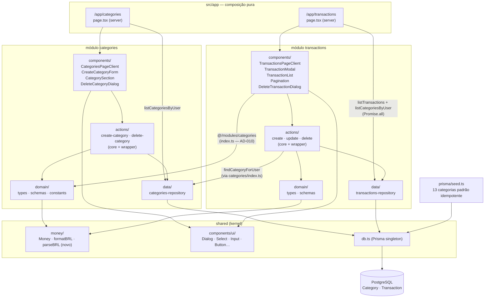

# Categories + Transactions Design

**Spec**: `.specs/features/categories-transactions/spec.md`
**Context**: `.specs/features/categories-transactions/context.md`
**Status**: Pending approval

---

## Architecture Overview

Dois novos domínios completos construídos em paralelo:

- **`categories`**: seed global de categorias padrão, CRUD de personalizadas por usuário, exclusão bloqueada quando em uso com confirmação digitada.
- **`transactions`**: CRUD completo de transações avulsas (entrada/saída), listagem paginada com ordenação determinística, modal unificado de criação/edição, confirmação de exclusão.

Ambos seguem a arquitetura em camadas do monolito modular (AD-001): `domain` → `data` → `actions` → `components`. As páginas em `src/app` são composição pura. Transações importa categorias exclusivamente via `categories/index.ts` (AD-010). Valores trafegam em centavos inteiros em todas as camadas (AD-008); UI recebe `formatBRL` / `parseBRL` do `shared`.



---

## Code Reuse Analysis

### Existing Components to Leverage

| Component | Location | How to Use |
| --------- | -------- | ---------- |
| `Money`, `formatBRL`, `moneySchema` | `src/shared/money/` | Display de valores na listagem; branded type para centavos |
| `parseBRL` (novo) | `src/shared/money/` | Parsing de input BRL (`"1.234,56"`) → centavos no submit do form |
| Prisma client | `src/shared/db.ts` | Repositórios de categorias e transações |
| Card, Input, Label, Button | `src/shared/components/ui/` | Base de todos os formulários e listagens |
| `/app` layout + `src/proxy.ts` | `src/app/app/layout.tsx` · `src/proxy.ts` | Proteção das rovas rotas herdada automaticamente — sem mudança |
| `auth.api.getSession` | `src/modules/auth` | Obter `userId` da sessão nos server components e actions |
| Action pattern (core + wrapper) | `src/modules/auth/actions/` | Separar lógica testável (`*-core.ts`) do wrapper `"use server"` |
| Discriminated result `{ ok: true\|false }` | `src/modules/auth/actions/` | Resultado uniforme de todas as mutations |
| Zod domain schemas | `src/modules/auth/domain/schemas.ts` | Padrão: schema em `domain/`, `safeParse` na fronteira da action |

### Integration Points

| System | Integration Method |
| ------ | ------------------ |
| Prisma / PostgreSQL | Novos models `Category` e `Transaction`; índices parciais SQL na migration |
| `/app` layout | Novas rotas `/app/transactions` e `/app/categories` herdam o `getSession` do layout existente |
| `categories` → `transactions` | `transactions` importa `findCategoryForUser`, `listCategoriesByUser` e tipos via `@/modules/categories` `index.ts` (AD-010) |
| shadcn/ui | Adicionar `Dialog`, `Select` (e opcionalmente `Separator`) via `npx shadcn@latest add` |

---

## Components

### 1. Prisma models + migration (CAT-04, TXN-03, TXN-04)

- **Purpose**: Persistência de categorias e transações com integridade referencial garantida no banco.
- **Location**: `prisma/schema.prisma` + nova migration
- **Schema**:

```prisma
model Category {
  id           String        @id @default(cuid())
  name         String
  type         String        // "entrada" | "saida"
  userId       String?       // null = padrão global; non-null = personalizada
  user         User?         @relation(fields: [userId], references: [id])
  transactions Transaction[]

  @@map("category")
}

model Transaction {
  id          String   @id @default(cuid())
  type        String   // "entrada" | "saida"
  date        String   // YYYY-MM-DD (date-only; sem timezone — AD spec)
  amount      Int      // centavos inteiros; AD-008; > 0
  description String?  // null quando ausente; máx 140 chars
  categoryId  String
  category    Category @relation(fields: [categoryId], references: [id], onDelete: Restrict)
  userId      String
  user        User     @relation(fields: [userId], references: [id])
  createdAt   DateTime @default(now())
  updatedAt   DateTime @updatedAt

  @@map("transaction")
}
```

  Adicionar ao model `User` existente:
  ```prisma
  categories   Category[]
  transactions Transaction[]
  ```

- **Constraints especiais (SQL raw na migration — Prisma não suporta índices parciais/funcionais)**:

```sql
-- Unicidade de nomes de categorias padrão (userId IS NULL), case-insensitive
CREATE UNIQUE INDEX category_default_unique_name_type
  ON category (lower(name), type)
  WHERE user_id IS NULL;

-- Unicidade de nomes de categorias personalizadas por usuário, case-insensitive
CREATE UNIQUE INDEX category_custom_unique_name_type_user
  ON category (lower(name), type, user_id)
  WHERE user_id IS NOT NULL;
```

  **Workflow**: `prisma migrate dev --create-only` → edição manual do SQL gerado para incluir os dois índices → `prisma migrate dev` aplica.

- **Nota `onDelete: Restrict`**: a FK `Transaction.category` com `Restrict` garante que nunca existe transação apontando para categoria excluída; a integridade final não depende só do check prévio na action — o banco decide no caso de corrida.
- **Dependencies**: `prisma/schema.prisma` atual (modelo `User`)

---

### 2. Seed de categorias padrão (CAT-01, CAT-02)

- **Purpose**: Popular categorias globais (`userId = null`) de forma idempotente em qualquer ambiente.
- **Location**: `prisma/seed.ts` (criado; rodar via `package.json > prisma.seed`)
- **Dados**:

```typescript
const DEFAULT_CATEGORIES = [
  // saida (9)
  { name: "Alimentação",             type: "saida" },
  { name: "Moradia",                 type: "saida" },
  { name: "Transporte",              type: "saida" },
  { name: "Saúde",                   type: "saida" },
  { name: "Educação",                type: "saida" },
  { name: "Lazer",                   type: "saida" },
  { name: "Vestuário",               type: "saida" },
  { name: "Assinaturas e serviços",  type: "saida" },
  { name: "Outros",                  type: "saida" },
  // entrada (4)
  { name: "Salário",                 type: "entrada" },
  { name: "Renda extra",             type: "entrada" },
  { name: "Investimentos",           type: "entrada" },
  { name: "Outros",                  type: "entrada" },
] as const
```

- **Idempotência**: `prisma.category.createMany({ data: DEFAULT_CATEGORIES, skipDuplicates: true })` — o índice parcial `category_default_unique_name_type` absorve duplicatas em re-execuções.
- **Integração CI**: o seed é chamado no `global-setup` dos testes de integração (ou em script separado `pnpm prisma db seed`) antes de cada ambiente de teste.

---

### 3. `shared/money`: `parseBRL` (TXN-04, edge case de máscara)

- **Purpose**: Converter string de input BRL (`"1.234,56"`) em centavos inteiros (`123456`) — simétrico de `formatBRL`. Necessário em toda camada que aceita input de valor monetário da UI.
- **Location**: `src/shared/money/index.ts` (novo export)
- **Interface**:

```typescript
/**
 * Converte string BRL ("1.234,56") em centavos inteiros.
 * Retorna null se o input não for parseável como número válido.
 * O resultado 0 é válido (o chamador valida regras de negócio > 0).
 */
export function parseBRL(raw: string): number | null {
  const digits = raw.replace(/\./g, "").replace(",", ".")
  const value = parseFloat(digits)
  if (isNaN(value)) return null
  return Math.round(value * 100)
}
```

- **Casos cobertos**:
  - `"250,37"` → `25037`
  - `"1.234,56"` → `123456`
  - `"5000"` → `500000`
  - `"0,01"` → `1`
  - `"abc"` → `null`
- **Nota**: não retorna `Money` branded — retorna `number | null` para que o chamador aplique o schema Zod `z.number().int().min(1).max(1_000_000_000)` com mensagens de erro contextualizadas.
- **Dependencies**: sem deps externas

---

### 4. `categories` domain (CAT-03, CAT-04, CAT-05, CAT-06)

- **Purpose**: Tipos TypeScript e schemas Zod para categorias — sem Prisma, Next, ou React.
- **Location**: `src/modules/categories/domain/`
- **Interfaces**:

```typescript
// types.ts
export type CategoryType = "entrada" | "saida"

export type Category = {
  id: string
  name: string
  type: CategoryType
  userId: string | null  // null = padrão global
}

export type CreateCategoryInput = {
  name: string   // após trim, 1–40 chars
  type: CategoryType
}

// schemas.ts
export const categoryTypeSchema = z.enum(["entrada", "saida"])

export const createCategoryInputSchema = z.object({
  name: z.string().trim().min(1, "Nome obrigatório").max(40, "Máximo 40 caracteres"),
  type: categoryTypeSchema,
})

// constants.ts
export const CATEGORY_NAME_IN_USE_ERROR = "Nome já existe para este tipo de categoria"
export const CATEGORY_IN_USE_ERROR = "Categoria em uso — remova as transações antes de excluir"
export const CATEGORY_NOT_FOUND_ERROR = "Categoria não encontrada"
```

- **Dependencies**: Zod

---

### 5. `categories` data layer (CAT-04, CAT-06, CAT-07)

- **Purpose**: Acesso ao banco para categorias; `userId` obrigatório em todas as operações de escrita/exclusão (AD-012).
- **Location**: `src/modules/categories/data/categories-repository.ts`
- **Interfaces**:

```typescript
// Lista padrão (userId=null) + personalizadas do usuário, ordenadas por nome
listCategoriesByUser(userId: string): Promise<Category[]>

// Busca categoria por id visível para o usuário (padrão OU personalizada do próprio)
// Retorna null se inexistente, de outro usuário, ou com tipo incompatível (quando typeFilter fornecido)
findCategoryForUser(
  categoryId: string,
  userId: string,
  typeFilter?: CategoryType
): Promise<Category | null>

// Verifica se nome já existe (case-insensitive) entre personalizadas do usuário OU padrão do mesmo tipo
isCategoryNameTaken(name: string, type: CategoryType, userId: string): Promise<boolean>

// Verifica se a categoria tem transações vinculadas (para bloquear exclusão)
isCategoryInUse(categoryId: string): Promise<boolean>

// Cria categoria personalizada vinculada ao usuário
createCategory(input: CreateCategoryInput & { userId: string }): Promise<Category>

// Exclui categoria personalizada do usuário
// Lança AppError("CATEGORY_NOT_FOUND") se: inexistente, padrão, ou de outro usuário
// A FK Restrict do banco rejeita se houver transações vinculadas (corrida)
deleteCategory(categoryId: string, userId: string): Promise<void>
```

- **Nota AD-012**: `deleteCategory` filtra `{ id: categoryId, userId }` — impossível excluir categoria de outro usuário mesmo com request direto.
- **Nota `isCategoryNameTaken`**: usa `findFirst` com `OR: [{ userId: null, type }, { userId }, ...]` e `name: { equals: name, mode: "insensitive" }` (Prisma case-insensitive mode).
- **Dependencies**: `@/shared` (prisma, types)

---

### 6. `categories` actions (CAT-03, CAT-05, CAT-07)

- **Purpose**: Fronteira HTTP do módulo — sessão, validação Zod, autorização, chamada ao repositório.
- **Location**: `src/modules/categories/actions/`
- **Interfaces**:

```typescript
// create-category-action.ts  ("use server")
createCategoryAction(input: unknown): Promise<
  | { ok: true; category: Category }
  | { ok: false; error: string; fieldErrors?: Record<string, string[]> }
>
// create-category-core.ts (testável, sem "use server"):
// 1. getSession → userId
// 2. safeParse(createCategoryInputSchema)
// 3. isCategoryNameTaken → { ok: false, CATEGORY_NAME_IN_USE_ERROR }
// 4. createCategory → { ok: true, category }

// delete-category-action.ts  ("use server")
deleteCategoryAction(categoryId: string): Promise<
  | { ok: true }
  | { ok: false; error: string }
>
// delete-category-core.ts:
// 1. getSession → userId
// 2. isCategoryInUse → { ok: false, CATEGORY_IN_USE_ERROR }
// 3. deleteCategory(categoryId, userId)
//    - não encontrada/padrão/outro usuário: { ok: false, CATEGORY_NOT_FOUND_ERROR }
//    - FK Restrict lança (corrida): catch → { ok: false, CATEGORY_IN_USE_ERROR }
// 4. { ok: true }
```

- **Revalidação**: componentes client chamam `router.refresh()` após sucesso (consistente com o padrão do módulo auth).
- **Dependencies**: domain schemas/constants, data layer, `auth.api.getSession`, `next/headers`

---

### 7. `categories` components (CAT-02, CAT-03, CAT-07)

- **Purpose**: UI da página `/app/categories` em pt-BR.
- **Location**: `src/modules/categories/components/`
- **Componentes**:

  **`CategorySection`** — exibe uma seção (entrada ou saída) com sub-listas "Padrão" e "Personalizadas"; botão de exclusão apenas em personalizadas; badge/label visual distinguindo padrão de personalizada.

  **`CreateCategoryForm`** (`"use client"`) — formulário inline com campo nome + `<Select>` de tipo (entrada/saída); submete `createCategoryAction`; exibe erro de campo abaixo do input; limpa e faz `router.refresh()` após sucesso.

  **`DeleteCategoryDialog`** (`"use client"`) — Dialog shadcn em duas variantes:
  - **Em uso**: título "Categoria em uso", mensagem explicando o bloqueio, botão "Fechar" apenas.
  - **Livre**: aviso explícito de irreversibilidade + `<Input>` controlado exigindo digitação exata de `"excluir permanentemente"` (case-sensitive) + botão "Excluir" habilitado somente quando o texto confere + spinner durante o submit.

  **`CategoriesPageClient`** (`"use client"`) — coordena o estado do dialog (qual categoria está pendente de exclusão) e recebe `categories: Category[]` como props do server component.

- **Dependencies**: `@/shared` (Dialog, Select, Input, Label, Button), actions e tipos do módulo

---

### 8. `categories/index.ts` — API pública (CAT-*)

```typescript
// Tipos
export type { Category, CategoryType, CreateCategoryInput }

// Schemas (consumidos pelo domínio de transactions para validar tipo)
export { categoryTypeSchema }

// Data (consumido por server components de transactions e de categories)
export { listCategoriesByUser, findCategoryForUser }

// Actions
export { createCategoryAction, deleteCategoryAction }

// Components (consumido por app/app/categories/page.tsx)
export { CategoriesPageClient }
```

---

### 9. `transactions` domain (TXN-01, TXN-04, TXN-05)

- **Purpose**: Tipos e schemas Zod de transações — sem Prisma, Next, ou React.
- **Location**: `src/modules/transactions/domain/`
- **Interfaces**:

```typescript
// types.ts
export type Transaction = {
  id: string
  type: "entrada" | "saida"
  date: string           // YYYY-MM-DD
  amount: Money          // branded int cents
  description: string | null
  categoryId: string
  categoryName: string   // join no repositório; para exibição na listagem
  userId: string
  createdAt: Date
}

export type TransactionInput = {
  type: "entrada" | "saida"
  date: string
  amountRaw: string      // string BRL da UI; convertida no core via parseBRL
  description?: string
  categoryId: string
}

// schemas.ts
const MIN_DATE = "2000-01-01"
function maxDate(): string { /* +100 anos de hoje */ }

export const transactionTypeSchema = z.enum(["entrada", "saida"])

export const transactionInputSchema = z.object({
  type: transactionTypeSchema,
  date: z.string()
    .regex(/^\d{4}-\d{2}-\d{2}$/, "Data inválida")
    .refine(d => d >= MIN_DATE && d <= maxDate(), "Data fora do intervalo permitido"),
  amountRaw: z.string().min(1, "Valor obrigatório"),
  description: z.string().trim().max(140, "Máximo 140 caracteres").optional()
    .or(z.literal("")).transform(v => (v?.trim() || undefined)),
  categoryId: z.string().min(1, "Categoria obrigatória"),
})

// constants.ts
export const TRANSACTION_NOT_FOUND_ERROR = "Transação não encontrada"
export const INVALID_AMOUNT_ERROR = "Valor inválido — informe um valor em reais (ex: 1.250,00)"
export const INVALID_CATEGORY_ERROR = "Categoria inválida ou incompatível com o tipo da transação"
```

- **Nota `amountRaw`**: o schema Zod valida apenas que o campo não está vazio; a conversão `parseBRL` → validação de centavos `z.number().int().min(1).max(1_000_000_000)` acontece no core da action (server-side), garantindo never-float no servidor independente da UI.
- **Dependencies**: Zod, `@/shared/money` (Money branded type)

---

### 10. `transactions` data layer (TXN-03, TXN-06, TXN-07, TXN-08, TXN-09, TXN-10)

- **Purpose**: Acesso ao banco para transações; `userId` obrigatório em toda operação (AD-012).
- **Location**: `src/modules/transactions/data/transactions-repository.ts`
- **Interfaces**:

```typescript
const PAGE_SIZE = 20

listTransactions(userId: string, page: number): Promise<{
  items: Transaction[]   // inclui categoryName via include
  total: number
  page: number           // página efetiva (1-based)
  totalPages: number
}>

createTransaction(input: {
  type: string; date: string; amount: number
  description?: string; categoryId: string; userId: string
}): Promise<Transaction>

updateTransaction(
  id: string,
  userId: string,
  input: { type: string; date: string; amount: number; description?: string; categoryId: string }
): Promise<Transaction>
// Usa updateMany({ where: { id, userId } }) — count 0 → lança AppError("NOT_FOUND")

deleteTransaction(id: string, userId: string): Promise<void>
// Usa deleteMany({ where: { id, userId } }) — count 0 → silencioso (idempotente para duplo clique)

findTransactionById(id: string, userId: string): Promise<Transaction | null>
```

- **Ordenação**: `orderBy: [{ date: "desc" }, { createdAt: "desc" }]` — determinístico (spec AC 1 de listagem).
- **Join de categoria**: `include: { category: { select: { name: true } } }` → `categoryName` mapeado na função de serialização do repo.
- **Paginação**: `skip: (page - 1) * PAGE_SIZE, take: PAGE_SIZE`; `count()` em query paralela (`Promise.all`); `totalPages = Math.ceil(total / PAGE_SIZE) || 1`.
- **Dependencies**: `@/shared` (prisma), domain types

---

### 11. `transactions` actions (TXN-03, TXN-05, TXN-09, TXN-10)

- **Purpose**: Fronteira HTTP — sessão, validação Zod, conversão BRL→cents, validação de categoria, persistência.
- **Location**: `src/modules/transactions/actions/`
- **Interfaces**:

```typescript
// create-transaction-action.ts ("use server")
createTransactionAction(input: unknown): Promise<
  | { ok: true; transaction: Transaction }
  | { ok: false; error: string; fieldErrors?: Record<string, string[]> }
>

// update-transaction-action.ts ("use server")
updateTransactionAction(id: string, input: unknown): Promise<
  | { ok: true; transaction: Transaction }
  | { ok: false; error: string; fieldErrors?: Record<string, string[]> }
>

// delete-transaction-action.ts ("use server")
deleteTransactionAction(id: string): Promise<
  | { ok: true }
  | { ok: false; error: string }
>
```

- **Core de create/update** (fluxo comum):
  1. `getSession` → `userId`
  2. `safeParse(transactionInputSchema)` → fieldErrors se inválido
  3. `parseBRL(amountRaw)` → `null` → `INVALID_AMOUNT_ERROR`
  4. `z.number().int().min(1).max(1_000_000_000).safeParse(amountCents)` → erro de valor
  5. `findCategoryForUser(categoryId, userId, type)` → `null` → `INVALID_CATEGORY_ERROR`
  6. `createTransaction` / `updateTransaction`

- **Validação de categoria**: usa `findCategoryForUser` importado de `@/modules/categories` via `index.ts` (AD-010). O `typeFilter` garante rejeição de mismatch tipo/categoria no servidor.
- **Core files**: `create-transaction-core.ts`, `update-transaction-core.ts`, `delete-transaction-core.ts` (testáveis sem `"use server"`).
- **Dependencies**: domain schemas, data layer, `@/modules/categories`, `auth.api.getSession`

---

### 12. `transactions` components — modal (TXN-01, TXN-02, TXN-10)

- **Purpose**: Formulário unificado de criação e edição em um Dialog shadcn.
- **Location**: `src/modules/transactions/components/TransactionModal.tsx` (`"use client"`)
- **Props**:

```typescript
type TransactionModalProps = {
  categories: Category[]            // pré-carregadas do server
  transaction?: Transaction         // undefined = criação; definida = edição (pré-popula)
  open: boolean
  onOpenChange: (open: boolean) => void
  onSuccess: () => void             // chama router.refresh() + fecha
}
```

- **Comportamento**:
  - Estado interno: `type`, `date`, `amountRaw`, `description`, `categoryId`, erros, `isPending`
  - Categorias filtradas: `categories.filter(c => c.type === selectedType)` — re-filtra quando tipo muda
  - Quando `type` muda: reset `categoryId` (evita mismatch)
  - Campo `amount`: `<input type="text" inputMode="decimal" placeholder="0,00">` — sem máscara de biblioteca; conversão no submit
  - Campo `date`: `<input type="date">` nativo com `min="2000-01-01"` e `max="+100anos"` (hint client; server valida)
  - On submit: chama `createTransactionAction` ou `updateTransactionAction` → router.refresh() → fecha
  - Título do dialog: "Nova transação" (criação) / "Editar transação" (edição)
- **Dependencies**: `@/shared` (Dialog, Select, Input, Label, Button), actions, tipo `Category` de `@/modules/categories`

---

### 13. `transactions` components — lista + paginação (TXN-06, TXN-07)

- **Purpose**: Exibição de transações com distinção visual obrigatória de tipo e navegação numerada.
- **Location**: `src/modules/transactions/components/`

**`TransactionList`** (`"use client"`) — recebe `items: Transaction[]`, callbacks `onEdit` e `onDelete`:
  - Cada linha: data (`toLocaleDateString("pt-BR")`), descrição ou `"—"`, nome da categoria, valor com `formatBRL`
  - Entrada: valor em verde; saída: valor em vermelho — distinção visual obrigatória (TXN-06 AC 3)
  - Pill/badge de tipo ("Entrada" / "Saída") em cada linha
  - Botões "Editar" e "Excluir" por linha

**`TransactionsEmptyState`** — estado vazio com CTA "Registrar primeira transação" (TXN-07 AC 4); nunca tela em branco.

**`Pagination`** — navegação numerada estilo `[← Anterior] [1] [2] … [N] [Próxima →]`:
  - Renderiza `<Link href="?page=N">` (compatível com RSC — não precisa de client state)
  - Página atual destacada visualmente
  - Truncamento com `…` quando `totalPages > 7` (agent discretion na lógica de elipse)
  - Pode ser server component (apenas links)

**`TransactionsPageClient`** (`"use client"`) — coordena estado: `modalOpen: boolean`, `editingTransaction: Transaction | null`, `deletingTransaction: Transaction | null`; recebe props do server; compõe `TransactionList + TransactionModal + DeleteTransactionDialog`.

---

### 14. `transactions` components — confirmação de exclusão (TXN-09)

- **Purpose**: Confirmação simples (sem texto digitado) antes de excluir transação — spec diferencia explicitamente de categoria.
- **Location**: `src/modules/transactions/components/DeleteTransactionDialog.tsx` (`"use client"`)
- **Props**: `open`, `onOpenChange`, `transaction: Transaction | null`, `onDeleted: () => void`
- **Comportamento**: Dialog shadcn com "Tem certeza que deseja excluir esta transação?" + botões "Cancelar" e "Excluir" (variant destrutivo) + spinner no pending + `deleteTransactionAction(transaction.id)` → `router.refresh()` → `onDeleted()`.

---

### 15. `transactions/index.ts` — API pública (TXN-*)

```typescript
// Tipos
export type { Transaction, TransactionInput }

// Data (para server components — pages)
export { listTransactions }

// Actions
export { createTransactionAction, updateTransactionAction, deleteTransactionAction }

// Components (consumido por app/app/transactions/page.tsx)
export { TransactionsPageClient }
```

---

### 16. App Router pages (CAT-02, TXN-06, TXN-07)

- **Purpose**: Composição de server components; sem lógica de negócio (AD-001).
- **Location**: `src/app/app/`

**`src/app/app/categories/page.tsx`** (server component):
```typescript
export default async function CategoriesPage() {
  const session = await auth.api.getSession({ headers: await headers() })
  // redirect já feito pelo layout; session sempre presente aqui
  const categories = await listCategoriesByUser(session.user.id)
  return <CategoriesPageClient categories={categories} />
}
```

**`src/app/app/transactions/page.tsx`** (server component):
```typescript
export default async function TransactionsPage({
  searchParams,
}: {
  searchParams: Promise<{ page?: string }>  // Next.js 16 async — AD-013
}) {
  const session = await auth.api.getSession({ headers: await headers() })
  const { page: pageParam } = await searchParams
  const requestedPage = parseInt(pageParam ?? "1") || 1

  const [txnData, categories] = await Promise.all([
    listTransactions(session.user.id, requestedPage),
    listCategoriesByUser(session.user.id),
  ])

  // TXN-07 AC 6: se página fora do range, clamp para o range válido
  const safePage = Math.max(1, Math.min(requestedPage, txnData.totalPages || 1))
  const data = safePage !== requestedPage
    ? await listTransactions(session.user.id, safePage)
    : txnData

  return <TransactionsPageClient {...data} categories={categories} />
}
```

- **Dependencies**: exports públicos de `@/modules/auth`, `@/modules/categories`, `@/modules/transactions`

---

### 17. shadcn/ui additions (AD-004)

- **Components a adicionar**:
  - `Dialog` — modal de transação e de confirmação de exclusão de categoria
  - `Select` — seletor de tipo e de categoria nos formulários
  - `Separator` (opcional) — divisor entre padrão e personalizadas na listagem de categorias
- **Adição**: `npx shadcn@latest add dialog select separator`
- **Location**: `src/shared/components/ui/` + exports em `src/shared/index.ts`

---

### 18. Testes (AD-011, todos os requisitos)

| Camada | O quê | Onde |
| ------ | ----- | ---- |
| Unit | `parseBRL`: formatos BRL, null em inválidos, limites (0,01 e 10M), sem vírgula | `src/shared/__tests__/money.test.ts` |
| Unit | `createCategoryInputSchema`: nome vazio, >40 chars, tipo inválido, trim | `src/modules/categories/__tests__/schemas.test.ts` |
| Unit | `transactionInputSchema`: data fora da janela, data futura válida, descrição >140, tipo enum, amountRaw vazio | `src/modules/transactions/__tests__/schemas.test.ts` |
| Integração | `createCategoryAction`: cria personalizada; duplicata case-insensitive (mesmo tipo) → erro; isolamento (usuário B não vê categoria de A — CAT-06) | `src/modules/categories/__tests__/create-category.integration.test.ts` |
| Integração | `deleteCategoryAction`: bloqueada quando em uso; exclusão OK sem uso com texto correto; padrão → rejeitado; outro usuário → rejeitado; corrida corrida exclusão × transação (FK Restrict previne) — CAT-07 | `src/modules/categories/__tests__/delete-category.integration.test.ts` |
| Integração | `createTransactionAction`: persiste em centavos corretos; zero/negativo/float → rejeitado; categoria de outro usuário → rejeitado; tipo incompatível com categoria → rejeitado; data fora da janela → rejeitado; data futura → aceita — TXN-03..05 | `src/modules/transactions/__tests__/create-transaction.integration.test.ts` |
| Integração | `listTransactions`: ordenação (data desc, desempate createdAt desc); paginação (25 txns → p1 tem 20, p2 tem 5); isolamento (usuário A não vê txns de B) — TXN-06..08 | `src/modules/transactions/__tests__/list-transactions.integration.test.ts` |
| Integração | `deleteTransactionAction`: hard delete; duplo delete idempotente (sem erro ao usuário); outro usuário → rejeitado. `updateTransactionAction`: validações preservadas; trocar tipo sem trocar categoria → rejeitado; outro usuário → rejeitado — TXN-09..10 | `src/modules/transactions/__tests__/txn-mutations.integration.test.ts` |
| E2E | Login → abrir modal → criar entrada ("Salário", R$ 5.000,00) → criar saída ("Alimentação", R$ 250,37) → ambas visíveis na listagem com tipo distinto, valor BRL correto e categoria correta — TXN-11 | `e2e/transactions.spec.ts` |

---

## Data Models

### Category

| Campo | Tipo Prisma | Regra |
| ----- | ----------- | ----- |
| `id` | `String @id @default(cuid())` | — |
| `name` | `String` | 1–40 chars (trim); case-insensitive unique por tipo/scope |
| `type` | `String` | `"entrada"` \| `"saida"` |
| `userId` | `String?` | `null` = padrão global; non-null = personalizada |
| `transactions` | `Transaction[]` | FK inversa |

Índices: `category_default_unique_name_type` (parcial, WHERE `user_id IS NULL`) e `category_custom_unique_name_type_user` (parcial, WHERE `user_id IS NOT NULL`) — ambos com `lower(name)`.

### Transaction

| Campo | Tipo Prisma | Regra |
| ----- | ----------- | ----- |
| `id` | `String @id @default(cuid())` | — |
| `type` | `String` | `"entrada"` \| `"saida"` |
| `date` | `String` | `YYYY-MM-DD`; janela `2000-01-01` → `+100 anos` |
| `amount` | `Int` | Centavos; `> 0`; `≤ 1_000_000_000` |
| `description` | `String?` | `null` quando ausente; máx 140 chars |
| `categoryId` | `String` | FK → Category (`onDelete: Restrict`) |
| `userId` | `String` | FK → User; AD-012 |
| `createdAt` | `DateTime @default(now())` | Usado no desempate de ordenação |
| `updatedAt` | `DateTime @updatedAt` | — |

### TypeScript domain types (espelhos dos models Prisma)

```typescript
// categories/domain/types.ts
type CategoryType = "entrada" | "saida"
type Category = { id: string; name: string; type: CategoryType; userId: string | null }

// transactions/domain/types.ts
type Transaction = {
  id: string; type: "entrada" | "saida"; date: string; amount: Money
  description: string | null; categoryId: string; categoryName: string
  userId: string; createdAt: Date
}
```

---

## Error Handling Strategy

| Error Scenario | Handling | User Impact |
| -------------- | -------- | ----------- |
| Nome de categoria vazio / >40 chars / tipo inválido | Zod rejeita no schema; `fieldErrors` | Mensagem inline no formulário |
| Nome de categoria duplicado (case-insensitive) | `isCategoryNameTaken` → `{ ok: false, CATEGORY_NAME_IN_USE_ERROR }` | Mensagem "nome já existe" — sem enumeração |
| Exclusão de categoria em uso | `isCategoryInUse` → `{ ok: false, CATEGORY_IN_USE_ERROR }` | Dialog mostra variante de bloqueio |
| Corrida checagem × delete de categoria (transação criada no intervalo) | FK Restrict lança → catch → `CATEGORY_IN_USE_ERROR` | Mesmo tratamento que "em uso" |
| Texto de confirmação errado na exclusão de categoria | Botão desabilitado client-side (controlled input comparado com `"excluir permanentemente"`) | Botão permanece inerte |
| Exclusão de categoria padrão / de outro usuário / inexistente | `deleteMany({ where: { id, userId, userId_not: null } })` → `CATEGORY_NOT_FOUND_ERROR` | Erro silencioso; dialog fecha |
| Valor de transação não parseável (`parseBRL` → null) | `INVALID_AMOUNT_ERROR` no fieldErrors | Erro de campo no modal |
| Valor zero / negativo / >R$10M | `z.number().int().min(1).max(1_000_000_000)` → fieldErrors | Erro de campo no modal |
| Data fora da janela ou formato inválido | Zod refine → fieldErrors | Erro de campo no modal |
| Descrição >140 chars após trim | Zod max → fieldErrors | Erro de campo no modal |
| Categoria invisível / de outro usuário / tipo incompatível | `findCategoryForUser` → null → `INVALID_CATEGORY_ERROR` | Erro de campo (categoria) no modal |
| Corrida exclusão-de-categoria × criação-de-transação | FK Restrict decide (banco): criação rejeitada (categoria inexistente) ou exclusão rejeitada (categoria em uso) | Mensagem de erro correspondente |
| Exclusão de transação de outro usuário / inexistente | `deleteMany` count=0 → `TRANSACTION_NOT_FOUND_ERROR` | Erro silencioso; listagem atualizada |
| Duplo clique de exclusão de transação | Segundo delete → count=0 → silencioso | Listagem atualizada; sem mensagem de erro ao usuário |
| Edição de transação de outro usuário | `updateMany` count=0 → `TRANSACTION_NOT_FOUND_ERROR` | Erro no modal; nada alterado |
| Página de transações fora do range | Page clamp no server component antes da query | Exibe página válida; sem 404 |

---

## Risks & Concerns

| Concern | Location | Impact | Mitigation |
| ------- | -------- | ------ | ---------- |
| Índices parciais/funcionais não suportados nativamente pelo Prisma | `prisma/schema.prisma` | Unicidade de nomes de categoria não pode ser declarada em Prisma — a migration gerada não incluirá os índices | Workflow: `migrate dev --create-only` + edição manual do SQL + commit da migration editada |
| `createMany({ skipDuplicates: true })` e índice parcial | `prisma/seed.ts` | Prisma usa `INSERT ... ON CONFLICT DO NOTHING` que respeita índices únicos — deve funcionar com o índice parcial. Testar em integração | Teste de seed duplo no CI confirma idempotência |
| `parseBRL` com input em formato US (`"250.37"`) | `shared/money/` | Interpretado como `"25037"` → R$ 250,37 vira R$ 25.037,00 — mau input, mas não é falha silenciosa (valor visivelmente errado no campo de confirmação ou no receipt) | Placeholder e label explicitam formato `"ex: 1.250,37"`; produto é pt-BR only |
| Modal de transação: categorias estale após criação de personalizada em outra aba | `transactions/page.tsx` | Nova categoria não aparece no select até `router.refresh()` ou navegação | `router.refresh()` no success de `createCategoryAction` re-fetch o server data; fluxo sequencial normal não é afetado |
| `searchParams` assíncrono no Next.js 16 | `transactions/page.tsx` | Esquecia o `await` causa tipo errado e falha em runtime | `searchParams: Promise<{page?: string}>` + `await searchParams` — AD-013 |
| `onDelete: Restrict` afeta categorias padrão usadas por muitos usuários | FK no banco | Categoria padrão nunca pode ser excluída enquanto qualquer transação a referencia | Intencional no MVP: padrão são imutáveis; não existe path de exclusão de padrão na UI ou actions |
| Categoria "Outros" duplicada no seed (uma para cada tipo) | Seed + índice | Duas linhas com `name = "Outros"` de tipos diferentes — não é duplicata por design | O índice inclui `type` como coluna — dois registros com mesmo nome mas tipos diferentes são permitidos e corretos |

---

## Tech Decisions

| Decision | Choice | Rationale |
| -------- | ------ | --------- |
| Categorias padrão como registros globais (`userId = null`) | Registros na tabela `category` compartilhados | Evita copiar N registros por usuário no signup; JOIN natural com transações; sem path de mutação = imutabilidade garantida |
| `type` como `String` (não Prisma `enum`) | `String` na tabela | Prisma enums são PostgreSQL enums — difíceis de alterar com migration; `String` + Zod enum garante a mesma segurança de tipo |
| Data como `String` (`YYYY-MM-DD`) | Campo `date String` | Elimina bugs de fuso horário na virada de mês; consistente com `birthDate` e `termsAcceptedAt` em `User` |
| `onDelete: Restrict` na FK `category → transaction` | Prisma schema | Integridade final não depende apenas do check prévio na action; corridas são tratadas pelo banco (edge case da spec) |
| Índices parciais via SQL raw na migration | `CREATE UNIQUE INDEX ... WHERE ...` | Prisma 6.x não suporta `WHERE` em `@@unique` nem `LOWER()` funcional; SQL raw é a única forma de garantir a constraint exigida |
| `parseBRL` em `shared/money/` | Módulo shared | Simétrico a `formatBRL`; módulos futuros (`commitments`) precisarão de inputs de valor BRL — reside no kernel compartilhado |
| Conversão BRL → cents no core da action (server-side) | `*-core.ts` | Garante never-float no servidor independente da UI; client apenas passa a string raw |
| Modal unificado para criação e edição (`transaction?` prop opcional) | `TransactionModal` | Reutilização de componente; UX consistente; decisão confirmada pelo usuário |
| Paginação via `?page=N` + `<Link>` (sem client state) | Server component re-render | Compatível com App Router; deep-link funcional; sem `useRouter` extra |
| Confirmação de exclusão de transação: dialog simples (sem texto digitado) | `DeleteTransactionDialog` | Spec diferencia explicitamente: transação = ação barata (nenhuma cascata, pode recriar); categoria personalizada = configuração do usuário (requer confirmação digitada) |
| `router.refresh()` após mutations (não `revalidatePath` na action) | Client components | Padrão consistente com o módulo `auth`; action não precisa de `next/cache` — componente client orquestra o reload |

---

## Requirement → Component mapping

| ID | Component(s) |
| -- | ------------ |
| CAT-01 | Comp. 2 (seed idempotente `createMany skipDuplicates`) + Comp. 1 (model `Category`) |
| CAT-02 | Comp. 7 (`CategorySection`, `CategoriesPageClient`) + Comp. 16 (`categories/page.tsx`) |
| CAT-03 | Comp. 4 (domain schema) + Comp. 6 (`createCategoryAction`) + Comp. 7 (`CreateCategoryForm`) |
| CAT-04 | Comp. 1 (índices parciais SQL) + Comp. 5 (`isCategoryNameTaken`) + Comp. 6 (check no core) |
| CAT-05 | Comp. 4 (Zod schema) + Comp. 6 (`safeParse` na action) |
| CAT-06 | Comp. 5 (`listCategoriesByUser` com `userId`) + Comp. 6 (`userId` da sessão, nunca do payload) |
| CAT-07 | Comp. 1 (FK Restrict) + Comp. 5 (`isCategoryInUse`, `deleteCategory`) + Comp. 6 (`deleteCategoryAction`) + Comp. 7 (`DeleteCategoryDialog` com texto digitado) |
| TXN-01 | Comp. 9 (schema) + Comp. 12 (`TransactionModal` — todos os campos) + Comp. 16 (`transactions/page.tsx`) |
| TXN-02 | Comp. 12 (filtro de categorias por tipo no select) + Comp. 11 (validação tipo/categoria no core) |
| TXN-03 | Comp. 10 (`createTransaction` + `userId` da sessão) + Comp. 11 (`createTransactionAction`) |
| TXN-04 | Comp. 3 (`parseBRL`) + Comp. 9 (schema) + Comp. 11 (validação de centavos no core) |
| TXN-05 | Comp. 9 (Zod schema) + Comp. 11 (`safeParse` na fronteira da action) |
| TXN-06 | Comp. 10 (`listTransactions` com ordenação determinística) + Comp. 13 (`TransactionList` + `formatBRL` + distinção visual entrada/saída) |
| TXN-07 | Comp. 10 (paginação 20 itens) + Comp. 13 (`Pagination` numerada + `TransactionsEmptyState`) + Comp. 16 (page clamp de fora do range) |
| TXN-08 | Comp. 10 (`userId` em todas as queries) + Comp. 11 (`userId` da sessão, nunca do payload) |
| TXN-09 | Comp. 10 (`deleteTransaction` idempotente) + Comp. 11 (`deleteTransactionAction`) + Comp. 14 (`DeleteTransactionDialog`) |
| TXN-10 | Comp. 10 (`updateTransaction`) + Comp. 11 (`updateTransactionAction`) + Comp. 12 (modal pré-preenchido + re-filtro de categoria) |
| TXN-11 | Comp. 18 (`e2e/transactions.spec.ts`) |
