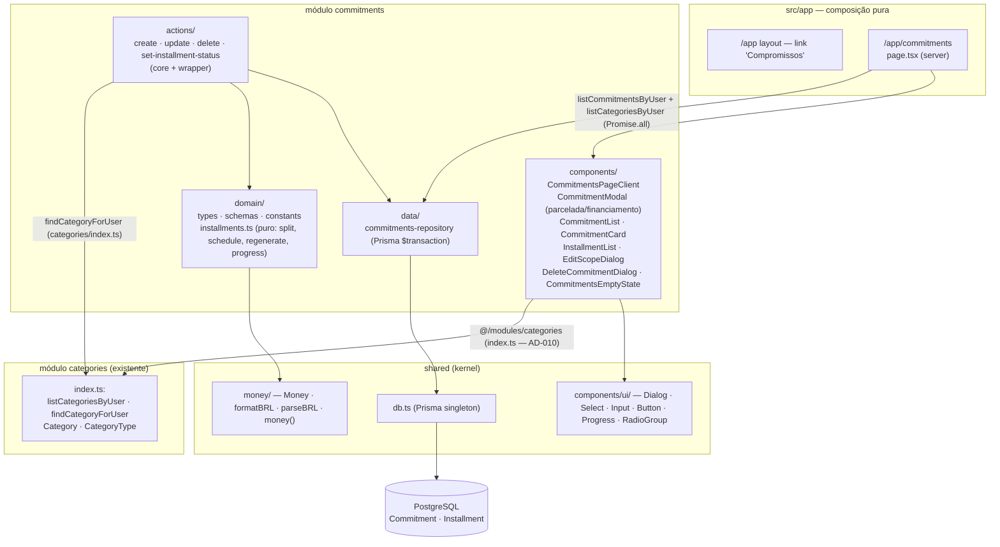

# Commitments Design

**Spec**: `.specs/features/commitments/spec.md`
**Context**: `.specs/features/commitments/context.md`
**Status**: Pending approval

---

## Architecture Overview

Um domínio novo e completo (`commitments`) na arquitetura em camadas do monolito modular (AD-001): `domain` → `data` → `actions` → `components`, com a página `/app/commitments` como composição pura. O módulo importa `categories` (seletor + validação), `shared` (Money/db) e `auth` (sessão) apenas via seus `index.ts` (AD-010). **Não toca `transactions`** (decisão do usuário: parcelas não poluem a lista de avulsas).

O coração é um conjunto de **funções puras de domínio** (sem Prisma/Next/React) que garantem as invariantes financeiras (AD-009, AD-008) e são cobertas por testes unitários:

- **Materialização**: `(total, N) → N parcelas` com piso e sobra de centavos na 1ª (soma = total exato).
- **Cronograma**: `(1ª data, N) → N vencimentos mensais` com clamp para o último dia do mês.
- **Regeneração**: em edição, as parcelas **previstas** são recalculadas do zero a partir dos novos parâmetros, mantendo as **pagas** congeladas (histórico imutável) e preservando a invariante de soma.

Cada compromisso é um registro pai (`Commitment`) + N filhos materializados (`Installment`) com vencimento, valor, categoria e status (`prevista | paga`) próprios (AD-009). Valores em centavos inteiros em todas as camadas (AD-008).



---

## Approaches Considered (data model — the one architectural fork)

Todas entregam o mesmo escopo; a escolha é onde as parcelas materializadas vivem.

| Abordagem | Descrição | Trade-off | Veredito |
| --------- | --------- | --------- | -------- |
| **A. Duas tabelas dedicadas `Commitment` + `Installment`** ⭐ | Pai + filhos materializados, cada parcela com `amount/dueDate/status/categoryId/userId` próprios | +Literal ao AD-009; +`transactions` intacta (decisão do usuário); +fonte limpa e por-parcela para `projections` (item 5 agrega por categoria/mês); −novo par de tabelas | **Escolhida** |
| B. Reutilizar `Transaction` para parcelas + `Commitment` pai | Parcelas como linhas de `transaction` com `commitmentId`/`status`/`installmentNumber` | −Suja a tabela e as queries de avulsas; −contradiz "não poluir /app/transactions"; −exige `status` em transação (não existe) | Rejeitada |
| C. Só `Commitment`, parcelas calculadas on-the-fly | Sem linhas de parcela | −AD-009 exige status por parcela (paga/prevista) persistido; impossível marcar paga | Rejeitada |

**Decisão de categoria (dentro de A):** `categoryId` vive **apenas no `Commitment`** (pai). As parcelas **não** guardam categoria própria — herdam a do compromisso na exibição e na agregação. Consequência (decisão do usuário 2026-07-19): **trocar a categoria sempre afeta o compromisso inteiro** (todas as parcelas, inclusive as já pagas); não há "trocar categoria só das futuras". A escolha "só futuras / todas as previstas" da edição vale, portanto, **apenas para o valor**. Simplicidade sobre granularidade. `projections` (item 5) obtém a categoria via join `Installment → Commitment → Category`.

---

## Code Reuse Analysis

### Existing Components to Leverage

| Component | Location | How to Use |
| --------- | -------- | ---------- |
| `money`, `formatBRL`, `parseBRL`, `Money` | `src/shared/money/` (via `@/shared`) | Branded cents; exibir BRL na lista/parcelas; parse do input de valor no core |
| Prisma client | `src/shared/db.ts` (via `@/shared`) | Repositório de compromissos; `prisma.$transaction` para materialização atômica |
| `Dialog`, `Select`, `Input`, `Label`, `Button` | `src/shared/components/ui/` | Modal de compromisso, seletor de categoria/modo, confirmações |
| `/app` layout + `src/proxy.ts` | `src/app/app/layout.tsx` · `src/proxy.ts` | Proteção da rota `/app/commitments` herdada automaticamente |
| `auth.api.getSession({ headers })` | `@/modules/auth` | `userId` da sessão em server component e no core das actions |
| Padrão action core+wrapper + `Result = {ok:true}|{ok:false,error,fieldErrors?}` | `src/modules/transactions/actions/` | Reproduzir idêntico para as 4 actions de commitments |
| Padrão repository (`updateMany/deleteMany` filtrando `{id,userId}`, `AppError`, serialização com `money()`) | `src/modules/transactions/data/transactions-repository.ts` | Base do `commitments-repository` |
| `findCategoryForUser(id, userId, typeFilter)` / `listCategoriesByUser(userId)` | `@/modules/categories` (index.ts) | Validar categoria de saída no core; popular seletor (só `type="saida"`) |
| Página server + `router.refresh()` após mutação (lição L-009) | `src/modules/transactions/components/*` | Padrão de revalidação client-side |

### Integration Points

| System | Integration Method |
| ------ | ------------------ |
| Prisma / PostgreSQL | Novos models `Commitment` e `Installment`; FKs `Restrict` para `Category`, `Cascade` de `Installment`→`Commitment`; índices em `userId`/`commitmentId` |
| `categories` → `commitments` | `findCategoryForUser`/`listCategoriesByUser`/tipos via `@/modules/categories` `index.ts` (AD-010); seletor filtra `type="saida"` |
| `/app` layout | Nova rota `/app/commitments` herda `getSession`/proteção do layout existente; adicionar link de navegação |
| shadcn/ui | `Dialog`/`Select` já presentes (feature 3); adicionar `Progress` e `RadioGroup` (barra de quitação e escolha de modo) |
| `projections` (item 5, futuro) | Consumirá `listInstallmentsByUser`/`listCommitmentsByUser` via `commitments/index.ts`; não implementado aqui, mas a API pública já expõe a leitura |

---

## Data Models

### Commitment (pai)

```prisma
model Commitment {
  id               String        @id @default(cuid())
  mode             String        // "parcelada" | "financiamento"
  description      String        // 1..140 (trim)
  totalAmount      Int           // centavos; parcelada: input; financiamento: parcela × N; > 0, ≤ 1_000_000_000
  installmentCount Int           // N; 2..360
  firstDueDate     String        // YYYY-MM-DD (âncora do dia de vencimento)
  categoryId       String
  category         Category      @relation(fields: [categoryId], references: [id], onDelete: Restrict)
  userId           String
  user             User          @relation(fields: [userId], references: [id])
  installments     Installment[]
  createdAt        DateTime      @default(now())
  updatedAt        DateTime      @updatedAt

  @@index([userId])
  @@map("commitment")
}
```

### Installment (filho materializado)

```prisma
model Installment {
  id           String     @id @default(cuid())
  commitmentId String
  commitment   Commitment @relation(fields: [commitmentId], references: [id], onDelete: Cascade)
  number       Int        // ordinal 1-based por dueDate (recalculado a cada escrita)
  dueDate      String     // YYYY-MM-DD
  amount       Int        // centavos; ≥ 1
  status       String     // "prevista" | "paga"
  userId       String     // denormalizado (AD-012) — filtra toggle/isolamento sem join
  // categoria NÃO fica aqui (Opção B): herdada do Commitment pai
  createdAt    DateTime   @default(now())
  updatedAt    DateTime   @updatedAt

  @@index([commitmentId])
  @@index([userId])
  @@map("installment")
}
```

Adicionar back-relations aos models existentes:
```prisma
// model User
commitments  Commitment[]
installments Installment[]

// model Category
commitments Commitment[]
```

- **`onDelete: Restrict`** em `Commitment.category`: qualquer categoria referenciada por um compromisso não pode ser excluída (estende a proteção de CAT-07 — edge case da spec). Como toda parcela pertence a um compromisso, a categoria fica protegida enquanto houver o compromisso. A exclusão de categoria em `categories` já usa `deleteMany({ id, userId })` e captura a violação de FK como "em uso".
- **`onDelete: Cascade`** de `Installment`→`Commitment`: só dispara quando excluímos o `Commitment` inteiro (caso "sem parcelas pagas"); no caso com pagas, **não** excluímos o pai (ver Delete), então nenhuma paga é apagada por cascade.
- **`Int`** comporta até ~R$ 21,4M; teto de negócio R$ 10.000.000,00 mantém folga (AD-008).
- Sem enum Prisma para `mode`/`status`/type — `String` + Zod enum (mesma decisão da feature 3).

### TypeScript domain types

```typescript
// commitments/domain/types.ts
export type CommitmentMode = "parcelada" | "financiamento"
export type InstallmentStatus = "prevista" | "paga"

export type Installment = {
  id: string
  number: number
  dueDate: string            // YYYY-MM-DD
  amount: Money              // branded cents
  status: InstallmentStatus
  // sem categoria própria (Opção B): usa a do Commitment pai
}

export type Commitment = {
  id: string
  mode: CommitmentMode
  description: string
  totalAmount: Money
  installmentCount: number
  firstDueDate: string
  categoryId: string         // categoria do compromisso (aplica a todas as parcelas)
  categoryName: string
  userId: string
  installments: Installment[]
  createdAt: Date
}

// View model com agregados de quitação (computeProgress)
export type CommitmentProgress = {
  paidCount: number
  totalCount: number
  paidAmount: Money          // soma das pagas
  remainingAmount: Money     // soma das previstas
  isSettled: boolean         // paidCount === totalCount
  percent: number            // 0..100 (paidCount/totalCount)
}

// Input de criação (dois modos)
export type CreateCommitmentInput = {
  mode: CommitmentMode
  description: string
  categoryId: string
  amountRaw: string          // BRL da UI: total (parcelada) ou parcela fixa (financiamento)
  installmentCount: number
  firstDueDate: string
}

// Escopo de edição
export type EditScope = "todas" | "futuras"
```

---

## Components

### 1. Prisma models + migration (CMT-02, CMT-05, edge FK)

- **Purpose**: Persistência pai+filhos com integridade referencial no banco.
- **Location**: `prisma/schema.prisma` + nova migration (`prisma migrate dev`).
- **Detalhes**: models acima; sem SQL raw (não há índice parcial/funcional aqui — diferente da feature 3). `prisma migrate dev --name commitments` gera e aplica.

---

### 2. `commitments/domain` — funções puras (CMT-02, CMT-03, CMT-07, CMT-14, CMT-15) ⭐ núcleo testável

- **Purpose**: Toda a matemática financeira e de cronograma, sem I/O. É o alvo dos testes unitários da invariante (AD-009).
- **Location**: `src/modules/commitments/domain/installments.ts`
- **Interfaces**:

```typescript
/** Divide total em n parcelas: piso em todas, sobra de centavos na PRIMEIRA.
 *  Invariante: sum(resultado) === total; resultado.length === n. */
export function splitInstallments(totalCents: number, n: number): number[]

/** n vencimentos mensais a partir de firstDueDate (âncora = dia de firstDueDate).
 *  Dia inexistente no mês → último dia do mês (clamp). Data-only, sem timezone.
 *  startOffset permite continuar o cronograma (append de parcelas). */
export function scheduleDueDates(firstDueDate: string, n: number, startOffset?: number): string[]

/** Materialização inicial (criação): retorna { amount, dueDate } para as N parcelas. */
export function materialize(input: {
  mode: CommitmentMode
  amountCents: number        // total (parcelada) OU parcela fixa (financiamento)
  installmentCount: number
  firstDueDate: string
}): { totalAmount: number; installments: { amount: number; dueDate: string }[] }
// parcelada: totalAmount = amountCents; splitInstallments(total, N)
// financiamento: totalAmount = amountCents * N; todas as parcelas = amountCents (resto 0)

/** Regeneração das PREVISTAS na edição, congelando as parcelas "frozen" (pagas
 *  sempre; + previstas vencidas quando scope="futuras"). Mantém a invariante:
 *  sum(frozen) + sum(regeneradas) === novo totalAmount.
 *  Lança/retorna erro se: novo N < frozenCount; (parcelada) novo total < sum(frozen);
 *  alguma parcela regenerada < 1 centavo. */
export function regeneratePrevistas(input: {
  mode: CommitmentMode
  amountCents: number          // novo total (parcelada) ou nova parcela (financiamento)
  installmentCount: number     // novo N
  firstDueDate: string
  frozen: { number: number; dueDate: string; amount: number }[]
}): { totalAmount: number; regenerated: { amount: number; dueDate: string }[] } | { error: string }

/** Agregados de quitação a partir das parcelas. */
export function computeProgress(installments: { amount: number; status: InstallmentStatus }[]): CommitmentProgress
```

- **`splitInstallments` (algoritmo)**: `base = Math.floor(total / n)`; `rem = total - base * n`; `arr = Array(n).fill(base)`; `arr[0] += rem`. Cobre AD-009 exatamente.
- **`scheduleDueDates` (algoritmo)**: extrai `anchorDay` de `firstDueDate`; para cada `i`, `monthIndex = (mês-1) + startOffset + i`; `y = ano + floor(monthIndex/12)`; `m = (monthIndex % 12) + 1`; `day = min(anchorDay, lastDayOfMonth(y, m))`; formata `YYYY-MM-DD`. Usa o **anchorDay original** a cada mês (31/01 → 28/02 → 31/03 reexpande). Aritmética pura, sem `Date` local (evita fuso — AD spec).
- **Dependencies**: nenhuma (Zod só nos schemas). Retorna `number` cru; o branding `Money` acontece no repositório/serialização.

---

### 3. `commitments/domain` — schemas e constants (CMT-04, CMT-05)

- **Location**: `src/modules/commitments/domain/schemas.ts`, `constants.ts`
- **Interfaces**:

```typescript
export const commitmentModeSchema = z.enum(["parcelada", "financiamento"])

const MIN_DATE = "2000-01-01"
function maxDate(): string { /* +100 anos, igual a transactions */ }

export const createCommitmentInputSchema = z.object({
  mode: commitmentModeSchema,
  description: z.string().trim().min(1, "Descrição obrigatória").max(140, "Máximo 140 caracteres"),
  categoryId: z.string().min(1, "Categoria obrigatória"),
  amountRaw: z.string().min(1, "Valor obrigatório"),   // parseBRL no core
  installmentCount: z.coerce.number().int()
    .min(2, "Mínimo de 2 parcelas").max(360, "Máximo de 360 parcelas"),
  firstDueDate: z.string()
    .regex(/^\d{4}-\d{2}-\d{2}$/, "Data inválida")
    .refine(d => d >= MIN_DATE && d <= maxDate(), "Data fora do intervalo permitido"),
})

export const updateCommitmentInputSchema = createCommitmentInputSchema.extend({
  scope: z.enum(["todas", "futuras"]).default("todas"),
})

export const setInstallmentStatusSchema = z.object({
  installmentId: z.string().min(1),
  status: z.enum(["prevista", "paga"]),   // estado DESEJADO → idempotente
})

// constants.ts
export const COMMITMENT_NOT_FOUND_ERROR = "Compromisso não encontrado"
export const INSTALLMENT_NOT_FOUND_ERROR = "Parcela não encontrada"
export const INVALID_AMOUNT_ERROR = "Valor inválido — informe um valor em reais (ex: 1.250,00)"
export const INVALID_CATEGORY_ERROR = "Categoria inválida ou incompatível (deve ser de saída)"
export const INSTALLMENT_TOO_SMALL_ERROR = "Parcelas demais para este valor — cada parcela ficaria abaixo de R$ 0,01"
export const TOTAL_BELOW_PAID_ERROR = "O novo valor é menor que o total já pago"
export const COUNT_BELOW_PAID_ERROR = "O número de parcelas é menor que o número de parcelas já pagas"
```

- **Nota**: `amountRaw` só valida "não vazio"; a conversão `parseBRL` + validação de centavos (`z.number().int().min(1).max(1_000_000_000)`) roda no core (server-side), never-float garantido independente da UI (mesmo padrão da feature 3).

---

### 4. `commitments/data` — repositório (CMT-05, CMT-08, CMT-10, CMT-12, CMT-16, CMT-17)

- **Purpose**: Acesso ao banco; `userId` obrigatório em toda operação (AD-012); materialização/regeneração atômicas via `prisma.$transaction`.
- **Location**: `src/modules/commitments/data/commitments-repository.ts`
- **Interfaces**:

```typescript
// Lista compromissos do usuário com parcelas (ordenadas por number asc), p/ agregados na página
listCommitmentsByUser(userId: string): Promise<Commitment[]>

// Compromisso único visível ao usuário (ou null)
getCommitmentForUser(id: string, userId: string): Promise<Commitment | null>

// Criação atômica: cria pai + N parcelas numeradas em uma transação
createCommitmentWithInstallments(data: {
  mode: string; description: string; totalAmount: number; installmentCount: number
  firstDueDate: string; categoryId: string; userId: string
  installments: { number: number; dueDate: string; amount: number; status: string }[]
}): Promise<Commitment>

// Edição atômica: atualiza campos do pai, DELETA todas as parcelas 'prevista' e
// insere as regeneradas; renumera todo o conjunto (pagas + novas) por dueDate.
// Filtra por { id, userId }. count 0 → AppError(COMMITMENT_NOT_FOUND_ERROR).
replacePrevistaInstallments(id: string, userId: string, patch: {
  description: string; categoryId: string; totalAmount: number; installmentCount: number
  firstDueDate: string
  regenerated: { dueDate: string; amount: number }[]
}): Promise<Commitment>

// Exclusão: se houver parcelas pagas → deleta só as 'prevista' e mantém o pai;
// senão → deleta o Commitment (cascade nas parcelas). Filtra { id, userId }.
deleteCommitment(id: string, userId: string): Promise<void>

// Toggle idempotente para estado desejado. Filtra { id, userId } (isolamento AD-012).
// count 0 → AppError(INSTALLMENT_NOT_FOUND_ERROR).
setInstallmentStatus(installmentId: string, userId: string, status: string): Promise<void>
```

- **Serialização**: mesma abordagem do `transactions-repository` — `money(amount)`, `category.name` via `include`, `type as ...`. Parcelas ordenadas `orderBy: { number: "asc" }`; compromissos `orderBy: { createdAt: "desc" }`.
- **Renumeração**: após regenerar, ordena `pagas ∪ regeneradas` por `dueDate` asc e atribui `number = índice+1`.
- **Isolamento**: toda query com `where: { userId }` (lista) ou `{ id, userId }` (mutação). `Installment.userId` denormalizado permite `setInstallmentStatus` filtrar sem join.
- **Dependencies**: `@/shared` (prisma, money), domain types/constants.

---

### 5. `commitments/actions` — fronteira (CMT-01, CMT-04..07, CMT-11..17)

- **Purpose**: Sessão + Zod + conversão BRL→cents + validação de categoria de saída + chamada ao domínio/repo. Par core (testável) + wrapper `"use server"`, idêntico à feature 3.
- **Location**: `src/modules/commitments/actions/`
- **Arquivos**: `create-commitment-core.ts`/`-action.ts`, `update-commitment-core.ts`/`-action.ts`, `delete-commitment-core.ts`/`-action.ts`, `set-installment-status-core.ts`/`-action.ts`, `index.ts`.

```typescript
type Result<T> = { ok: true } & T | { ok: false; error: string; fieldErrors?: Record<string,string[]> }

createCommitmentAction(input: unknown): Promise<Result<{ commitment: Commitment }>>
updateCommitmentAction(id: string, input: unknown): Promise<Result<{ commitment: Commitment }>>
deleteCommitmentAction(id: string): Promise<Result<{}>>
setInstallmentStatusAction(input: unknown): Promise<Result<{}>>
```

- **`createCommitmentCore`**:
  1. `getSession` → `userId` (senão `Unauthorized`).
  2. `safeParse(createCommitmentInputSchema)` → `fieldErrors`.
  3. `parseBRL(amountRaw)` → `null` → `INVALID_AMOUNT_ERROR`; valida centavos `> 0`.
  4. `findCategoryForUser(categoryId, userId, "saida")` → `null` → `INVALID_CATEGORY_ERROR` (garante categoria **de saída**, visível ao usuário).
  5. `materialize({ mode, amountCents, installmentCount, firstDueDate })` → `{ totalAmount, installments }`; se `totalAmount > 1_000_000_000` → erro de teto; se alguma parcela `< 1` → `INSTALLMENT_TOO_SMALL_ERROR`.
  6. `createCommitmentWithInstallments(...)` — pai com `categoryId`; parcelas com `status:"prevista"`, `userId` (sem categoria própria — Opção B).
- **`updateCommitmentCore`**:
  1–4. igual ao create (sessão, Zod `updateCommitmentInputSchema`, parseBRL, categoria de saída).
  5. `getCommitmentForUser(id, userId)` → `null` → `COMMITMENT_NOT_FOUND_ERROR`.
  6. **Categoria** (Opção B): a nova `categoryId` é sempre gravada no **pai** e vale para todas as parcelas — independe de `scope`.
  7. Determina `frozen` (para o **valor**): parcelas `paga` **sempre**; se `scope="futuras"`, adiciona `prevista` com `dueDate < hoje`.
  8. `regeneratePrevistas({ mode, amountCents, installmentCount, firstDueDate, frozen })` → em `error` retorna o erro (`TOTAL_BELOW_PAID_ERROR` / `COUNT_BELOW_PAID_ERROR` / `INSTALLMENT_TOO_SMALL_ERROR` / teto).
  9. `replacePrevistaInstallments(id, userId, { ...patch, regenerated })` — parcelas sem categoria própria.
- **`deleteCommitmentCore`**: `getSession` → `deleteCommitment(id, userId)` (repo decide preservar pagas). `AppError` de not-found vira `{ ok:false }` silencioso.
- **`setInstallmentStatusCore`**: `getSession` → `safeParse` → `setInstallmentStatus(installmentId, userId, status)`; idempotente (define estado desejado). not-found → `INSTALLMENT_NOT_FOUND_ERROR`.
- **Revalidação**: componentes client chamam `router.refresh()` no sucesso (lição L-009).
- **Dependencies**: domain, data, `@/modules/categories`, `@/modules/auth`, `@/shared/money`.

---

### 6. `commitments/components` — UI `/app/commitments` (CMT-01, CMT-06, CMT-08, CMT-09, CMT-11, CMT-13, CMT-17)

- **Location**: `src/modules/commitments/components/` (`"use client"` salvo onde indicado)
- **Componentes**:

  **`CommitmentsPageClient`** — coordena estado (`modalOpen`, `editing: Commitment | null`, `deleting`, `editScopePending`); recebe `commitments: Commitment[]` e `categories: Category[]` (só saída) do server; compõe lista + modal + diálogos.

  **`CommitmentModal`** — Dialog de criação/edição. `RadioGroup` de **modo** (parcelada/financiamento); o rótulo do campo de valor muda ("Valor total" ↔ "Valor da parcela"); campos: descrição, `<Select>` categoria (saída), valor (`inputMode="decimal"`, sem máscara de lib), Nº de parcelas (`type="number"`, 2–360), data da 1ª (`type="date"`, min/max hint). Em edição vem pré-preenchido. Prévia opcional (discrição do agente): mostrar valor calculado da parcela / total. Submete create/update action → `router.refresh()`.

  **`EditScopeDialog`** — quando a edição altera o **valor** e há > 1 parcela prevista, pergunta **"Aplicar a todas as parcelas previstas"** ou **"Somente às futuras (vencimento a partir de hoje)"**; a escolha vira `scope` no payload. (Se só existir 1 prevista, pula o diálogo e usa `todas`.) Trocar **categoria** não abre este diálogo — aplica sempre ao compromisso inteiro (Opção B).

  **`CommitmentList` + `CommitmentCard`** — cada card: descrição, categoria, `formatBRL(totalAmount)`, **progresso** (`paidCount/totalCount`, `formatBRL(paidAmount)` pago, `formatBRL(remainingAmount)` saldo devedor), `<Progress value={percent}>`, badge **"Quitado"** quando `isSettled`; botões Editar/Excluir; expande `InstallmentList`.

  **`InstallmentList`** — parcelas ordenadas por `number`: rótulo `k/N`, `dueDate` (`toLocaleDateString("pt-BR")`), `formatBRL(amount)`, e um **toggle** de status (checkbox/botão) que chama `setInstallmentStatusAction({ installmentId, status: alvo })` → `router.refresh()`. O alvo é o estado oposto ao atual (idempotência garantida no server pelo estado desejado).

  **`DeleteCommitmentDialog`** — confirmação simples; texto adapta: com parcelas pagas, explicita que só as **previstas** serão removidas e as pagas preservadas; sem pagas, remove tudo. Botão "Excluir" (destrutivo) → `deleteCommitmentAction(id)` → `router.refresh()`.

  **`CommitmentsEmptyState`** — estado vazio com CTA "Registrar primeiro compromisso" (CMT-09).

- **Dependencies**: `@/shared` (Dialog, Select, Input, Label, Button, Progress, RadioGroup), actions e tipos do módulo, `Category` de `@/modules/categories`.

---

### 7. `commitments/index.ts` — API pública (CMT-*)

```typescript
// Tipos
export type { Commitment, Installment, CommitmentMode, InstallmentStatus, CommitmentProgress } from "./domain/types"

// Data (server components — page atual; projections no item 5)
export { listCommitmentsByUser } from "./data/commitments-repository"

// Actions
export { createCommitmentAction } from "./actions/create-commitment-action"
export { updateCommitmentAction } from "./actions/update-commitment-action"
export { deleteCommitmentAction } from "./actions/delete-commitment-action"
export { setInstallmentStatusAction } from "./actions/set-installment-status-action"

// Components (consumido por app/app/commitments/page.tsx)
export { CommitmentsPageClient } from "./components/CommitmentsPageClient"
```

---

### 8. App Router page + navegação (CMT-08, CMT-09, CMT-10)

- **Location**: `src/app/app/commitments/page.tsx` (server component)

```typescript
export default async function CommitmentsPage() {
  const session = await auth.api.getSession({ headers: await headers() })
  const [commitments, categories] = await Promise.all([
    listCommitmentsByUser(session.user.id),
    listCategoriesByUser(session.user.id),               // filtrar type="saida" no client/modal
  ])
  return <CommitmentsPageClient commitments={commitments} categories={categories} />
}
```

- Adicionar link **"Compromissos"** → `/app/commitments` na navegação do `/app` layout (ao lado de Transações/Categorias).
- **Dependencies**: exports públicos de `@/modules/auth`, `@/modules/categories`, `@/modules/commitments`.

---

### 9. shadcn/ui additions (AD-004)

- Adicionar `Progress` (barra de quitação) e `RadioGroup` (escolha de modo): `npx shadcn@latest add progress radio-group`.
- `Dialog`/`Select`/`Input`/`Button` já existem (feature 3). Exportar novos em `src/shared/index.ts`.

---

### 10. Testes (AD-011 — pirâmide; lições L-006/L-007/L-008/L-009)

| Camada | O quê | Onde |
| ------ | ----- | ---- |
| Unit | `splitInstallments`: **invariante soma == total** para vários (total,N); sobra na 1ª (100,00/3 → [3334,3333,3333]); N divisível (resto 0); todas ≥ 1 centavo quando válido | `src/modules/commitments/__tests__/installments.test.ts` |
| Unit | `scheduleDueDates`: cadência mensal; clamp fim-de-mês (31/01→28/02→31/03); âncora reexpande; ano vira dezembro→janeiro; `startOffset` | idem |
| Unit | `materialize`: parcelada (total=input, split) vs financiamento (total=parcela×N, todas iguais) | idem |
| Unit | `regeneratePrevistas`: pagas congeladas; soma(frozen)+soma(regen)==novo total; rejeita novo total < pago (`TOTAL_BELOW_PAID_ERROR`); rejeita N < pagas (`COUNT_BELOW_PAID_ERROR`); rejeita parcela < 1 centavo; scope "futuras" congela previstas vencidas | idem |
| Unit | `computeProgress`: pagas/total, pago, saldo, isSettled, percent | idem |
| Unit | schemas: mode enum; N fora de 2–360; descrição vazia/>140; data fora da janela; amountRaw vazio | `src/modules/commitments/__tests__/schemas.test.ts` |
| Integração | `createCommitmentAction` parcelada: materializa N; **arredondamento na 1ª**; soma == total; vencimentos corretos; teto; parcela < 1 centavo rejeitada; categoria não-saída/de-outro-usuário rejeitada; isolamento (CMT-05) | `.../create-commitment.integration.test.ts` |
| Integração | `createCommitmentAction` financiamento: total = parcela×N; parcelas iguais; teto de `parcela×N` (CMT-06/07) | idem |
| Integração | `setInstallmentStatusAction`: marca/desmarca; idempotente p/ estado desejado; parcela de outro usuário rejeitada (CMT-11/12) | `.../installment-status.integration.test.ts` |
| Integração | `updateCommitmentAction`: redistribui só previstas com **pagas intactas**; soma mantém; rejeita total<pago e N<pagas; scope todas vs futuras (valor); trocar categoria afeta o compromisso inteiro; outro usuário rejeitado (CMT-13..16) | `.../update-commitment.integration.test.ts` |
| Integração | `deleteCommitmentAction`: sem pagas remove tudo; com pagas remove só previstas e preserva pagas; outro usuário rejeitado (CMT-17) | `.../delete-commitment.integration.test.ts` |
| Integração | Excluir categoria usada por um compromisso → bloqueado por FK Restrict (edge case) | `.../commitment-category-fk.integration.test.ts` |
| E2E | Login → criar parcelamento R$ 100,00 em 3x → ver 33,34/33,33/33,33 + vencimentos mensais → marcar 1ª paga → progresso 1/3 (CMT-18) | `e2e/commitments.spec.ts` |

- **Fixtures de integração** (lição L-008): usar helper de sessão real (cookie) + CPF com checksum válido, como corrigido na feature 3. **Seed de categorias** (L-007) já roda no setup de integração — reutilizar a categoria de saída "Financiamento"/"Outros".

---

## Error Handling Strategy

| Error Scenario | Handling | User Impact |
| -------------- | -------- | ----------- |
| mode/descrição/N/data inválidos | Zod → `fieldErrors` | Erro inline no modal |
| Valor não parseável (`parseBRL` null) ou ≤ 0 / > teto | `INVALID_AMOUNT_ERROR` / erro de teto no `amountRaw` | Erro de campo no modal |
| `parcela × N` (financiamento) ou total (parcelada) > R$ 10M | Erro de teto | Erro de campo |
| N grande demais (parcela < R$ 0,01) | `INSTALLMENT_TOO_SMALL_ERROR` | Erro de campo |
| Categoria inexistente / de outro usuário / não-saída | `findCategoryForUser(...,"saida")` null → `INVALID_CATEGORY_ERROR` | Erro de campo (categoria) |
| Editar total < soma já paga | `regeneratePrevistas` → `TOTAL_BELOW_PAID_ERROR` | Erro no modal; nada alterado |
| Reduzir N abaixo de nº de pagas | `COUNT_BELOW_PAID_ERROR` | Erro no modal; nada alterado |
| Editar/excluir/toggle de compromisso ou parcela de outro usuário / inexistente | filtro `{ id, userId }` count 0 → `*_NOT_FOUND_ERROR` | Erro silencioso; refresh |
| Toggle duplo concorrente | Estado **desejado** (idempotente): definir "paga" 2x = "paga" | Estado final único e válido; sem erro |
| Corrida exclusão-de-categoria × criação/edição de compromisso | FK Restrict decide no banco | Mensagem "categoria inválida/em uso" |
| Materialização parcial por falha | `prisma.$transaction` → rollback total | Nada persistido; erro genérico |

---

## Risks & Concerns

| Concern | Location | Impact | Mitigation |
| ------- | -------- | ------ | ---------- |
| Aritmética de datas com `Date` local introduz bug de fuso na virada de mês | `domain/installments.ts` | Vencimento off-by-one | `scheduleDueDates` usa aritmética pura de ano/mês/dia sobre strings, sem `new Date` local; testes de clamp e virada de ano cobrem |
| Regeneração de previstas em edição é o ponto mais complexo (frozen set, scope, invariante) | `domain/installments.ts` + `update-*-core.ts` | Cálculo errado quebra a soma ou toca pagas | Lógica centralizada numa função pura com testes exaustivos; repo só persiste; `$transaction` garante atomicidade |
| `scope="futuras"` com previstas **vencidas** (dueDate<hoje) — semântica sutil | `update-commitment-core.ts` | Usuário pode não esperar que vencidas fiquem congeladas | Definição explícita: "futuras" = previstas com `dueDate ≥ hoje`; documentada no diálogo e testada; caso raro (previstas normalmente são futuras). Vale só p/ valor |
| FK `Restrict` de `Commitment` para `Category` | schema Prisma | Categoria em uso por um compromisso não é excluível | Intencional (edge case da spec); teste de integração confirma o bloqueio |
| Cascade de `Installment` ao excluir `Commitment` poderia apagar pagas | schema Prisma | Perda de histórico | Só excluímos o `Commitment` quando **não há pagas**; com pagas, deletamos apenas linhas `prevista` e mantemos o pai — cascade nunca alcança pagas |
| Toggle baseado em "estado desejado" exige o client enviar o alvo | `InstallmentList` + action | Se o client enviar o estado atual, nada muda | Client calcula alvo = oposto do atual exibido; idempotência é a propriedade desejada (double-click seguro) |

---

## Tech Decisions

| Decision | Choice | Rationale |
| -------- | ------ | --------- |
| Data model | Duas tabelas `Commitment` + `Installment` (abordagem A) | Literal ao AD-009; não polui `transactions`; fonte limpa para `projections` |
| `categoryId` só no pai `Commitment` (Opção B — decisão do usuário 2026-07-19) | Parcelas não guardam categoria; herdam do compromisso | Simplicidade; trocar categoria sempre afeta o compromisso inteiro; "só futuras/todas" vale só para o valor; `projections` faz join parcela→compromisso→categoria |
| Tipo único, 2 modos (`mode`) | Um domínio; `parcelada` deriva parcela do total, `financiamento` deriva total da parcela | Decisão do usuário; uma tela, uma invariante |
| Edição = regenerar previstas do zero | Deletar linhas `prevista` + inserir regeneradas em `$transaction`; pagas intactas | Evita diffing frágil in-place; atomicidade; invariante recomputada de forma limpa |
| `frozen set` = pagas (+ vencidas quando scope=futuras) | Define precisamente o que a edição não toca | Mantém "pagas imutáveis" e dá semântica testável a "só futuras" |
| Toggle por **estado desejado** (`status` alvo) | `setInstallmentStatus(id, userId, status)` | Idempotente sob duplo clique (spec CMT-11 AC5) — melhor que flip cego |
| `mode`/`status`/`type` como `String` + Zod enum | Sem enum Prisma | Mesma decisão da feature 3 (migrations de enum são custosas) |
| Data como `String` `YYYY-MM-DD` | Campo string, aritmética pura | Consistente com `transactions`/`User`; elimina bug de fuso |
| Delete sem sub-escolha futuras/todas | Confirmação única: remove previstas, preserva pagas | O sentido natural de "cancelar compromisso" é cessar obrigações futuras; a escolha futuras/todas fica só na **edição** (roadmap agrupa, mas para delete colapsa) |
| `firstDueDate` como âncora de dia | Dia de vencimento = dia de `firstDueDate`, clamp EOM | Decisão do usuário; previsível |

> **Project-level:** nenhuma decisão nova de nível de projeto (novo `AD-NNN`) — o design conforma a AD-008/009/010/011/012/013/014 existentes.

---

## Requirement → Component mapping

| ID | Component(s) |
| -- | ------------ |
| CMT-01 | Comp. 3 (schema) + Comp. 6 (`CommitmentModal` modo parcelada) + Comp. 8 (page) |
| CMT-02 | Comp. 2 (`splitInstallments`/`materialize`) + Comp. 4 (`createCommitmentWithInstallments` atômico) + Comp. 1 (models) |
| CMT-03 | Comp. 2 (`scheduleDueDates` clamp EOM; status inicial prevista) |
| CMT-04 | Comp. 3 (Zod + parcela ≥ 1 centavo) + Comp. 5 (`createCommitmentCore` validações) |
| CMT-05 | Comp. 4 (`userId` em toda query) + Comp. 5 (`userId` da sessão, nunca do payload) |
| CMT-06 | Comp. 3 (schema) + Comp. 6 (`CommitmentModal` modo financiamento) |
| CMT-07 | Comp. 2 (`materialize` financiamento total=parcela×N) + Comp. 5 (teto) |
| CMT-08 | Comp. 2 (`computeProgress`) + Comp. 4 (`listCommitmentsByUser`) + Comp. 6 (`CommitmentCard`/`InstallmentList`) + Comp. 8 (page) |
| CMT-09 | Comp. 6 (`CommitmentsEmptyState`, badge "Quitado") |
| CMT-10 | Comp. 4 (queries com `userId`) + Comp. 8 (session) |
| CMT-11 | Comp. 4 (`setInstallmentStatus`) + Comp. 5 (core idempotente) + Comp. 6 (`InstallmentList` toggle) |
| CMT-12 | Comp. 4 (`{id,userId}` + estado desejado) + Comp. 5 (sessão) |
| CMT-13 | Comp. 6 (`CommitmentModal` pré-preenchido + `EditScopeDialog`) + Comp. 3 (`updateCommitmentInputSchema.scope`) |
| CMT-14 | Comp. 2 (`regeneratePrevistas` soma-invariante) + Comp. 5 (rejeita total<pago) |
| CMT-15 | Comp. 2 (`regeneratePrevistas` frozen + reschedule) + Comp. 5 (rejeita N<pagas) + Comp. 4 (renumeração) |
| CMT-16 | Comp. 3 (Zod) + Comp. 5 (validações da fronteira) + Comp. 4 (`{id,userId}`) |
| CMT-17 | Comp. 4 (`deleteCommitment` preserva pagas) + Comp. 5 (core) + Comp. 6 (`DeleteCommitmentDialog`) |
| CMT-18 | Comp. 10 (`e2e/commitments.spec.ts`) |

**Coverage:** 18/18 requisitos mapeados a componentes. ✅
