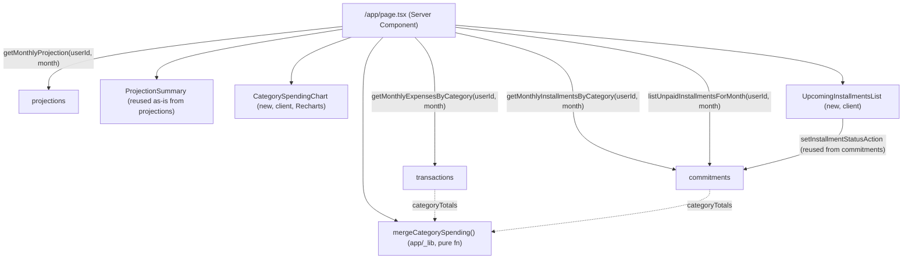

# Dashboard Design

**Spec**: `.specs/features/dashboard/spec.md`
**Status**: Draft

---

## Architecture Overview

`/app/page.tsx` (Server Component) fetches 4 aggregates in parallel for the current month — reusing `projections` for the summary and adding 3 new small aggregation functions to `transactions`/`commitments` (AD-016) — then composes them. No new module is created (roadmap: "apenas composição em `app/`"); the only new "logic" outside a module is a pure merge function that lives in `src/app/app/_lib/`.



**Single fork worth calling out:** the two category-aggregate arrays (transactions + commitments) need to be merged by `categoryId` before charting. Keeping each module's aggregation function returning its own array (mirrors `getMonthlyTransactionTotals`/`sumInstallmentsByMonth`, already independently unit/integration-testable) and doing the merge as one pure function in `app/_lib` — rather than inventing a 3rd cross-module aggregation API — keeps each module's contract simple and matches the same compose-at-the-call-site pattern `projections/services/get-monthly-projection.ts` already uses for entradas/saídas. Recommended and used below; no real alternative beats it without breaking AD-016 (aggregations belong to the owning module) or duplicating merge logic inside two modules.

---

## Code Reuse Analysis

### Existing Components to Leverage

| Component | Location | How to Use |
| --- | --- | --- |
| `ProjectionSummary` | `src/modules/projections/components/ProjectionSummary.tsx` | Reused **as-is**, no changes. It already renders entradas/saídas/saldo (+ total comprometido) from a `MonthlyProjection` — exactly what DASH-01/02/03 need. Satisfies the spec's success criterion that dashboard and `/app/projections` show identical numbers, because it's literally the same component + same data source. |
| `getMonthlyProjection` | `src/modules/projections/services/get-monthly-projection.ts` | Called directly for the current month; no new saldo logic. |
| `getCurrentMonth` | `src/modules/projections/domain/month.ts` | Reused for "mês atual" (`YYYY-MM` of today), avoids reimplementing month logic. |
| `setInstallmentStatusAction` | `src/modules/commitments/actions/set-installment-status-action.ts` | Called from the new `UpcomingInstallmentsList` client component — same call already used in `CommitmentsPageClient`. |
| `router.refresh()` + `useTransition` pattern | `src/modules/commitments/components/CommitmentsPageClient.tsx:39-45` | Reused verbatim for the mark-as-paid flow in `UpcomingInstallmentsList`, for consistency with the one existing place that already toggles installment status. Avoids introducing a second, divergent state-management style (optimistic local state) for the same action. |
| `formatBRL`, `addMoney`, `Money`, `Card` | `src/shared` | Reused in the new category-total repo functions and in `CategorySpendingChart`/`UpcomingInstallmentsList`. |
| Category name join pattern | `src/modules/commitments/data/commitments-repository.ts:20-32` (`listCommitmentsByUser`, `include: { category: { select: { name } } }`) | Same join shape reused in `getMonthlyInstallmentsByCategory` and `listUnpaidInstallmentsForMonth`. |
| Page skeleton (session → parse/get month → parallel fetch → render) | `src/app/app/projections/page.tsx` | Same shape reused for `src/app/app/page.tsx`, minus the month `searchParams` (dashboard has no navigation, per spec). |

### Integration Points

| System | Integration Method |
| --- | --- |
| `transactions` public API | New export `getMonthlyExpensesByCategory(userId, month)` added to `src/modules/transactions/index.ts` |
| `commitments` public API | New exports `getMonthlyInstallmentsByCategory(userId, month)` and `listUnpaidInstallmentsForMonth(userId, month)` added to `src/modules/commitments/index.ts` |
| `projections` public API | No changes — consumed as-is (`getMonthlyProjection`, `getCurrentMonth`, `ProjectionSummary`) |
| Database | No schema changes. Both new category-aggregate functions are `groupBy` queries on existing `Transaction`/`Installment` tables (mirrors `getMonthlyTransactionTotals`/`sumInstallmentsByMonth`); `listUnpaidInstallmentsForMonth` is a `findMany` with `status: "prevista"` + `dueDate` range filter, joining `Commitment` for description/category. |

---

## Components

### `getMonthlyExpensesByCategory` (transactions data layer)

- **Purpose**: Sum `saida`-type transactions for a month, grouped by category.
- **Location**: `src/modules/transactions/data/transactions-repository.ts` (new function, alongside `getMonthlyTransactionTotals`); exported via `src/modules/transactions/index.ts`
- **Interfaces**:
  - `getMonthlyExpensesByCategory(userId: string, month: string): Promise<CategorySpendingTotal[]>` — `CategorySpendingTotal = { categoryId: string; categoryName: string; total: Money }`, one entry per category with `total > 0`, no fixed order (merge/sort happens downstream)
- **Dependencies**: `prisma`, `money` (shared)
- **Reuses**: Same `groupBy` + `monthPrefix` string-match pattern as `getMonthlyTransactionTotals` (`transactions-repository.ts:220-237`), filtered to `type: "saida"` and grouped by `categoryId` instead of `type`; category name resolved via a follow-up `categories.findMany({ where: { id: { in } } })` or an `include` if the model allows it on a `groupBy` (Prisma `groupBy` doesn't support `include` — resolve names with a small follow-up `findMany`, same as needed in the commitments equivalent below).

### `getMonthlyInstallmentsByCategory` (commitments data layer)

- **Purpose**: Sum installments (any status) due in a month, grouped by the parent commitment's category.
- **Location**: `src/modules/commitments/data/commitments-repository.ts` (new function, alongside `sumInstallmentsByMonth`); exported via `src/modules/commitments/index.ts`
- **Interfaces**:
  - `getMonthlyInstallmentsByCategory(userId: string, month: string): Promise<CategorySpendingTotal[]>` — same shape as the transactions version
- **Dependencies**: `prisma`, `money`
- **Reuses**: Same `dueDate` `startsWith` month-prefix filter as `sumInstallmentsByMonth` (`commitments-repository.ts:378-397`); `Installment` doesn't carry `categoryId` directly (it belongs to `Commitment`), so this groups by `commitment.categoryId` — implemented as `groupBy` on `Installment` joined through a `where: { commitment: { userId } }` and a second pass resolving `commitmentId → categoryId/categoryName` (or, simpler: `prisma.installment.findMany({ where, select: { amount, commitment: { select: { categoryId, category: { select: { name } } } } } })` and reduce in application code — cheaper to reason about than a raw grouped join; installment counts per user per month are small).

### `listUnpaidInstallmentsForMonth` (commitments data layer)

- **Purpose**: List installments with status `prevista` due in the current month, ordered by `dueDate`, with enough denormalized data to render a row (description, category, amount, due date) without an extra fetch.
- **Location**: `src/modules/commitments/data/commitments-repository.ts` (new function); exported via `src/modules/commitments/index.ts`
- **Interfaces**:
  - `listUnpaidInstallmentsForMonth(userId: string, month: string): Promise<UpcomingInstallment[]>` — `UpcomingInstallment = { installmentId: string; commitmentId: string; description: string; categoryName: string; amount: Money; dueDate: string }`
- **Dependencies**: `prisma`, `money`
- **Reuses**: Same `include: { category: { select: { name } } }` join pattern as `listCommitmentsByUser` (`commitments-repository.ts:20-32`), applied to `prisma.installment.findMany` with `where: { commitment: { userId }, status: "prevista", dueDate: { startsWith: monthPrefix } }, orderBy: { dueDate: "asc" }, include: { commitment: { select: { description: true, category: { select: { name: true } } } } }`

### `mergeCategorySpending` (pure function, app-local)

- **Purpose**: Combine the two `CategorySpendingTotal[]` arrays (transactions + commitments) into one chart-ready array, summing amounts that share a `categoryId`, sorted by total descending.
- **Location**: `src/app/app/_lib/merge-category-spending.ts`
- **Interfaces**:
  - `mergeCategorySpending(transactionTotals: CategorySpendingTotal[], commitmentTotals: CategorySpendingTotal[]): CategorySpendingSlice[]` — `CategorySpendingSlice = { categoryId: string; categoryName: string; total: Money }`
- **Dependencies**: `addMoney` (shared)
- **Reuses**: `addMoney` for the sum, avoiding raw `+` on cents (AD-008)
- **Testing**: Pure, no Next.js/DB — unit-tested directly (`src/app/app/_lib/__tests__/merge-category-spending.test.ts`, matches Vitest's `src/**/__tests__/**/*.test.ts` glob, AD-011)

### `CategorySpendingChart` (new, client component)

- **Purpose**: Render the merged category totals as a Recharts chart; empty state when the array is empty (DASH-06).
- **Location**: `src/app/app/_components/CategorySpendingChart.tsx`
- **Interfaces**:
  - `CategorySpendingChart({ data: CategorySpendingSlice[] }): JSX.Element`
- **Dependencies**: `recharts` (new dependency, see Tech Decisions), `formatBRL` (shared)
- **Reuses**: n/a (first chart in the codebase)

### `UpcomingInstallmentsList` (new, client component)

- **Purpose**: Render the unpaid-installments-this-month list; mark-as-paid action per row; empty state (DASH-10).
- **Location**: `src/app/app/_components/UpcomingInstallmentsList.tsx`
- **Interfaces**:
  - `UpcomingInstallmentsList({ installments: UpcomingInstallment[] }): JSX.Element`
- **Dependencies**: `setInstallmentStatusAction` (commitments), `useTransition`, `useRouter` (next/navigation), `formatBRL`
- **Reuses**: `router.refresh()` + `useTransition` pattern from `CommitmentsPageClient.tsx:39-45`; error path shows an inline message and leaves the item in place (DASH-14) — action result is checked (`{ ok: false, error }`) instead of assumed to succeed, unlike the existing `CommitmentsPageClient` call which currently ignores the result (see Risks & Concerns).

### `/app/page.tsx` (modified)

- **Purpose**: Compose the dashboard — fetch, merge, render summary + chart + list + existing nav cards.
- **Location**: `src/app/app/page.tsx`
- **Interfaces**: Next.js page (default export, async Server Component, no props needed — no `searchParams`, per spec "sem navegação")
- **Dependencies**: `auth` (session), `projections`, `transactions`, `commitments`, the new `_lib`/`_components`
- **Reuses**: Session-fetch + "Unauthorized" guard pattern from `src/app/app/projections/page.tsx:18-24`; existing 4 nav cards markup (kept, moved below the new dashboard content)

---

## Data Models

No Prisma schema changes. New TypeScript-only shapes:

```typescript
// transactions/domain (or inline in the repository file — small, single-use)
type CategorySpendingTotal = {
  categoryId: string;
  categoryName: string;
  total: Money;
};

// commitments/domain
type UpcomingInstallment = {
  installmentId: string;
  commitmentId: string;
  description: string;
  categoryName: string;
  amount: Money;
  dueDate: string; // YYYY-MM-DD
};

// src/app/app/_lib — app-local, not exported from any module
type CategorySpendingSlice = {
  categoryId: string;
  categoryName: string;
  total: Money;
};
```

`CategorySpendingTotal` is defined independently in each module (not hoisted to `shared`) — same convention `transactions`/`commitments` already follow for the overlapping `categoryId`/`categoryName` shape on `Transaction`/`Commitment` (AD-010 module encapsulation; structural typing lets `mergeCategorySpending` accept both without a shared type).

**Relationships**: `CategorySpendingTotal` (×2, one per module) → merged by `mergeCategorySpending` into `CategorySpendingSlice` → `CategorySpendingChart`. `UpcomingInstallment` denormalizes `Commitment.description` + `Category.name` so `UpcomingInstallmentsList` needs no extra fetch per row.

---

## Error Handling Strategy

| Error Scenario | Handling | User Impact |
| --- | --- | --- |
| No transactions/commitments this month | Aggregation functions return `[]` / `saldo 0`; components render defined empty states (DASH-02, DASH-06, DASH-10) | Dashboard renders normally, no error |
| `setInstallmentStatusAction` fails (network/server error) | `UpcomingInstallmentsList` checks `{ ok: false, error }` and keeps the item, shows inline error text next to the row | Item stays in the list; user sees why and can retry |
| Unauthenticated access to `/app` | Existing session guard (reused from `projections/page.tsx`) throws `Unauthorized` | Same behavior as every other `/app/*` page today — no new handling needed |

---

## Risks & Concerns

| Concern | Location (file:line) | Impact | Mitigation |
| --- | --- | --- | --- |
| `recharts` is not in `package.json` yet | `package.json:21-36` | First chart dependency in the project; unverified peer-dep fit with React 19.2 / Next 16.2 in this exact repo (only verified generically via npm registry: recharts peer range covers React 16.8–19) | Install `recharts@^3` explicitly, then run `pnpm typecheck && pnpm build` (Node v24 per project memory) as part of the task that adds the dependency, before building the chart component on top of it — catch peer-dep/type issues immediately instead of after the UI is built |
| `CommitmentsPageClient.handleToggleInstallment` ignores the action's `{ ok, error }` result today | `src/modules/commitments/components/CommitmentsPageClient.tsx:39-45` | Pre-existing gap (silently no-ops on failure), not introduced by this feature | Out of scope to fix here (not part of DASH-* requirements) — `UpcomingInstallmentsList`'s own call site *does* check the result (DASH-14 requires it), so the new code doesn't repeat the gap; flagging only so it isn't mistaken for a new pattern to copy |
| `Installment` has no direct `categoryId` (only via `Commitment`) | `prisma/schema.prisma` (`Installment` model) | `getMonthlyInstallmentsByCategory` can't be a single flat `groupBy`; needs an application-level reduce over a joined `findMany` | Documented in the component's interface above; installment volume per user/month is small (materialized parcels, not raw events), so no pagination/perf concern expected — call out in the task's test as a note, not a blocker |

---

## Tech Decisions (only non-obvious ones)

| Decision | Choice | Rationale |
| --- | --- | --- |
| Chart type | Donut/pie with legend (Recharts `PieChart`) | Standard "where did the money go" visualization for a bounded, small category count; **implementer must load the `dataviz` skill before writing `CategorySpendingChart`'s color/legend logic** (project convention for any new chart) rather than picking colors ad hoc |
| Category color assignment | Deterministic palette cycling by array index (post-sort, pre-render) inside `CategorySpendingChart` | No `color` field on `Category` (out of scope, spec Assumptions); index-based cycling is stable within a single render and avoids a schema change |
| Mark-as-paid UI feedback | `router.refresh()` (Server Component re-fetch), not optimistic local state | Matches the one existing place that does this exact action (`CommitmentsPageClient`); avoids a second divergent pattern and the bugs that come from optimistic state drifting from server truth |
| "Mês atual" source | `getCurrentMonth()` from `projections`, called server-side in `page.tsx`, no `searchParams` | Spec: dashboard has no month navigation; reuses existing, tested month logic instead of reimplementing `new Date()` handling |
| New types location | Declared per-module (`transactions`, `commitments`), not in `shared` | Matches existing convention of independent `categoryId`/`categoryName` shapes per module; avoids coupling two domain modules through a new shared type for a merge that only the `app/` layer needs |

---

## Tips

- **Confirm before Tasks** — awaiting user approval of this design before breaking into tasks.
