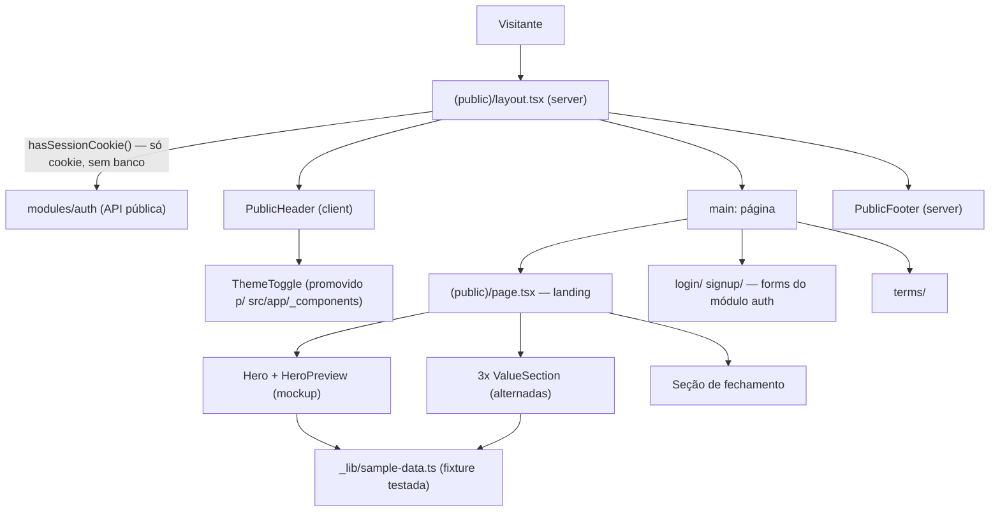

# Landing Design

**Spec**: `.specs/features/landing/spec.md`
**Context**: `.specs/features/landing/context.md`
**Status**: Approved (abordagem route group `(public)` confirmada pelo usuário em 2026-07-23)

---

## Architecture Overview

Abordagem confirmada: **route group `(public)`** — as quatro páginas públicas (`/`, `/login`, `/signup`, `/terms`) migram para `src/app/(public)/` com um `layout.tsx` único que renderiza o shell público (header + footer). Route groups não alteram URLs (AD-014 preservada). A landing é **composição em `app/`** (mesmo padrão do dashboard): nenhum módulo novo, sem banco, consumindo apenas `@/shared` e a API pública de `@/modules/auth`.

Detecção de sessão (LAND-16/17) é **otimista e sem banco**: o layout público lê o cookie de sessão do Better Auth via um novo helper `hasSessionCookie()` exposto pela API pública do módulo `auth` — o mesmo princípio do `proxy.ts` existente (`getSessionCookie` de `better-auth/cookies`), mantendo o detalhe do nome/formato do cookie encapsulado no módulo dono.



**Fluxo de renderização:** o layout público é um server component; a leitura de `cookies()` o torna dinâmico, mas sem nenhuma consulta a banco — `/` e `/terms` continuam renderizando com o banco fora do ar (LAND-06). `/login` e `/signup` mantêm o `getSession` real que já têm (autoridade, AUTH AC6 — fora do escopo mudar).

---

## Code Reuse Analysis

### Existing Components to Leverage

| Component | Location | How to Use |
| --- | --- | --- |
| `ThemeToggle` | `src/app/app/_components/theme-toggle.tsx` | **Promover** para `src/app/_components/theme-toggle.tsx` (usado pelos dois shells); atualizar import no `app-shell.tsx`. Zero mudança de markup/comportamento (SHELL-19..21 continuam cobertos) |
| `Providers` (next-themes) | `src/app/providers.tsx` | Já global no root layout — persistência de tema entre área pública e logada (LAND-09) vem de graça |
| `getSessionCookie` (padrão) | `src/proxy.ts` | Mesmo princípio otimista; implementação server-component via novo `hasSessionCookie()` no módulo auth |
| `Button`, `Card`, primitivos | `src/shared` | CTAs, cards do mockup e mini-visuais — só primitivos existentes, nenhum novo componente shadcn previsto |
| `formatBRL`, `money` | `src/shared` (AD-008) | Única via de formatação dos valores da fixture de exemplo (LAND-05) |
| `LoginForm`, `SignUpForm` | `src/modules/auth` | Restyle de apresentação in-place (LAND-14); páginas continuam importando via `index.ts` |
| Teste de contraste AA | `src/app/__tests__/theme-contrast.test.ts` | Lê `globals.css` direto — superfícies novas que só reusam tokens já ficam cobertas; se algum par texto/fundo novo surgir, adicionar o par ao teste (LAND-12) |
| Padrões E2E | `e2e/*.spec.ts` | `landing.spec.ts` novo segue o padrão de `shell.spec.ts`/`theme.spec.ts` (fixtures de usuário, seletores por role/label) |

### Integration Points

| System | Integration Method |
| --- | --- |
| Módulo `auth` | `hasSessionCookie(): Promise<boolean>` adicionado ao `index.ts` (AD-010: import externo só via index); encapsula `better-auth/cookies` |
| `proxy.ts` | Inalterado — matcher já cobre `/login`/`/signup` (redirect com cookie) e `/app/*`; `/` fica fora do matcher de propósito |
| Tokens de tema | `globals.css` como única fonte de cor (AD-017, SHELL-13); nenhum token novo previsto |
| Metadata | `export const metadata` por página; root layout mantém default |

---

## Components

### 1. Route group `(public)` + `layout.tsx` (PublicShell)

- **Purpose**: Shell único das páginas públicas — header, `<main>`, footer — com detecção otimista de sessão.
- **Location**: `src/app/(public)/layout.tsx` (server component)
- **Interfaces**: layout padrão do App Router; chama `hasSessionCookie()` e passa `hasSession` ao `PublicHeader`.
- **Dependencies**: `@/modules/auth` (só o helper de cookie), `PublicHeader`, `PublicFooter`.
- **Reuses**: padrão do `app/layout.tsx` da área logada (shell no layout, páginas limpas).
- **Nota de migração**: `page.tsx`, `login/`, `signup/`, `terms/` movem para dentro do grupo; URLs inalteradas. Skip link "Pular para o conteúdo" replicado do AppShell (LAND-12).

### 2. PublicHeader

- **Purpose**: Wordmark → `/`, âncoras (só na landing), CTAs de sessão e toggle de tema; sticky.
- **Location**: `src/app/(public)/_components/public-header.tsx` (client — precisa de `usePathname` para âncoras)
- **Interfaces**: `PublicHeader({ hasSession }: { hasSession: boolean })`.
- **Comportamento**:
  - Âncoras de `_lib/nav.ts` renderizadas apenas quando `pathname === "/"` (LAND-10); ocultas `< md` (LAND-11).
  - `hasSession ? "Ir para o app" (→ /app) : "Entrar" (→ /login) + "Criar conta" (→ /signup)` (LAND-16/17).
  - Sticky (`sticky top-0`) com fundo `bg-background` e borda inferior `border-border` — camada tonal, sem sombra (DESIGN.md Elevation).
  - `<nav>` com `aria-label`; foco visível via `ring` (LAND-12).
- **Reuses**: `Button`/`buttonVariants` de shared para CTAs; classes de foco do padrão do AppShell.

### 3. PublicFooter

- **Purpose**: Wordmark + tagline, link `/terms`, copyright (LAND-08).
- **Location**: `src/app/(public)/_components/public-footer.tsx` (server)
- **Interfaces**: sem props.
- **Reuses**: tokens de tipografia/cor; nenhum link inexistente (PRODUCT.md Evidence).

### 4. ThemeToggle (promoção)

- **Purpose**: Mesmo componente do item 7, agora compartilhado pelos dois shells (LAND-09).
- **Location**: move `src/app/app/_components/theme-toggle.tsx` → `src/app/_components/theme-toggle.tsx`; import atualizado em `app-shell.tsx`.
- **Interfaces/comportamento**: inalterados (grupo segmentado, `aria-pressed`, guarda `useMounted`).

### 5. `hasSessionCookie()` — módulo auth

- **Purpose**: Detecção otimista de sessão para server components públicos, sem banco (LAND-06/16/17).
- **Location**: `src/modules/auth/domain/session-cookie.ts` (ou vizinho de `domain/auth.ts`), exportado em `src/modules/auth/index.ts`.
- **Interfaces**: `hasSessionCookie(): Promise<boolean>` — lê `await cookies()` (next/headers) e verifica o cookie de sessão do Better Auth.
- **Nota de verificação**: `better-auth/cookies` exporta `getSessionCookie(request)` (usado no proxy) — a variante para server component (nome exato do cookie / util compatível com `cookies()`) **deve ser verificada na doc do Better Auth (Context7) na implementação**; não assumir. O nome do cookie varia com prefixo `__Secure-` em produção HTTPS — motivo para usar o util oficial, nunca hardcodar.
- **Testes**: unit do helper (cookie presente/ausente/prefixado); integração não precisa de banco.

### 6. Landing page (`(public)/page.tsx`) + seções

- **Purpose**: Página de conversão — hero, 3 seções alternadas, fechamento (LAND-01..04).
- **Location**: `src/app/(public)/page.tsx` (server) compondo:
  - `_components/hero.tsx` — h1 (proposta de valor com a tagline), subtítulo, CTAs "Criar conta" (primário) + "Entrar" (outline), `HeroPreview` ao lado/abaixo.
  - `_components/hero-preview.tsx` — mockup da projeção mensal recriado com primitivos de shared (Card + linhas de valores tabulares), dados da fixture; `aria-hidden` no decorativo, resumo textual acessível.
  - `_components/value-section.tsx` — seção genérica (título, texto, mini-visual, `reverse?: boolean`) instanciada 3× (previsibilidade, parcelas, projeção) com `id` de âncora; empilha no mobile (LAND-03).
  - Mini-visuais por pilar: recriações leves (ex.: card de parcelas com soma exata, linha de meses com saldo projetado) usando a mesma fixture.
  - `_components/closing-cta.tsx` — reforço da tagline + CTA "Criar conta" (LAND-04).
- **Copy**: pt-BR calma e direta (DESIGN.md "Do"); microcopy a critério do agente (context.md).
- **Reuses**: `Card`/`Button` de shared; hierarquia Display/Headline/Body do DESIGN.md; Acento Raro e Semântica Só em Número respeitadas nos visuais.

### 7. Sample data fixture

- **Purpose**: Dados de exemplo realistas e aritmética correta para todos os visuais (LAND-05).
- **Location**: `src/app/(public)/_lib/sample-data.ts` + `__tests__/sample-data.test.ts`
- **Interfaces**: constantes tipadas (ver Data Models); helpers de shared para formatação.
- **Testes (unit)**: parcelas somam o total; saldo projetado = entradas − saídas; todos os valores inteiros em centavos (AD-008).

### 8. Âncoras e scroll

- **Purpose**: Navegação intra-landing (LAND-10) com acessibilidade (edge case reduced-motion).
- **Location**: `src/app/(public)/_lib/nav.ts` (config `{ id, label }[]`); CSS em `globals.css`.
- **Comportamento**: `scroll-behavior: smooth` no `html` **dentro de** `@media (prefers-reduced-motion: no-preference)`; `scroll-margin-top` nas seções compensando o header sticky.

### 9. Restyle de `/login`, `/signup`, `/terms`

- **Purpose**: Card centrado sob o shell público; polish de apresentação nos forms (LAND-13..15).
- **Location**: páginas movidas para `(public)/`; `LoginForm`/`SignUpForm`/`sign-up-form` no módulo auth (apenas apresentação).
- **Restrições**: campos, validação Zod, mensagens comportamentais e fluxo de submit intocados; testes existentes continuam passando (ajuste de selector só se a semântica se mantém). `/terms` só herda shell + tipografia.

### 10. Metadata

- **Purpose**: LAND-19 — títulos/descriptions da tabela de assumptions da spec.
- **Location**: `export const metadata` em cada página do grupo; landing também define `description` da proposta de valor.

### 11. E2E

- **Purpose**: Fluxos do roadmap + P2.
- **Location**: `e2e/landing.spec.ts` (novo); `e2e/home.spec.ts` **reescrito** (ver Risks).
- **Cobertura**: anônimo `/` → hero → "Criar conta" → `/signup`; `/` → "Entrar" → `/login`; âncora rola até seção; logado vê "Ir para o app" → `/app`; tema alternado no header público persiste na área logada.

---

## Data Models

Fixture local (sem banco, sem Prisma) — tipos estreitos só para os visuais:

```typescript
// src/app/(public)/_lib/sample-data.ts
interface SampleInstallmentPlan {
  description: string;      // ex.: "Notebook em 10x"
  totalCents: number;       // soma EXATA de installmentsCents (testado)
  installmentsCents: number[]; // 1ª parcela absorve diferença de centavos (AD-009)
  paidCount: number;
}

interface SampleMonthProjection {
  monthLabel: string;          // ex.: "Agosto"
  incomeCents: number;         // entradas previstas
  expensesCents: number;       // saídas avulsas + parcelas
  projectedBalanceCents: number; // = incomeCents - expensesCents (testado)
}
```

**Relationships**: nenhuma — dados estáticos ilustrativos, nunca oriundos de usuário real (context.md).

---

## Error Handling Strategy

| Error Scenario | Handling | User Impact |
| --- | --- | --- |
| Banco indisponível | `/`, `/terms` e shell não tocam banco (cookie-only) | Landing e termos funcionam normalmente; login/signup falham como hoje (pré-existente) |
| Cookie de sessão expirado/inválido | Header mostra "Ir para o app"; `/app` (layout com `getSession` real) redireciona para `/login` | Um clique extra; trade-off aceito (context.md) |
| JS desabilitado / antes da hidratação | Header/CTAs/âncoras são links reais (`<a>`/`Link`); só o toggle de tema exige JS | Navegação e conversão funcionam sem JS |
| Âncora acessada de outra página (ex.: `/#previsibilidade` via URL) | Comportamento nativo do browser (landing renderiza e rola) | Funciona sem código extra |

---

## Risks & Concerns

| Concern | Location | Impact | Mitigation |
| --- | --- | --- | --- |
| `home.spec.ts` usa `getByText("Prumo", { exact: true })` — com wordmark no header + footer + hero, o strict mode do Playwright falha | `e2e/home.spec.ts:7` | E2E quebra na task da landing | Reescrever o spec junto com a task da landing (asserção por `role=heading`/hero); lição de projections: selectors acompanham a UI, semântica preservada |
| Nome/formato do cookie de sessão varia (`__Secure-` em HTTPS de produção) | `src/proxy.ts:12` (padrão) | "Ir para o app" nunca aparece em produção se o nome for hardcodado | `hasSessionCookie()` usa o util oficial de `better-auth/cookies` (verificar API para server components via Context7 na implementação); E2E cobre o caminho com sessão |
| `cookies()` no layout público torna as 4 páginas dinâmicas | `src/app/(public)/layout.tsx` (novo) | Perde renderização estática; custo de servidor marginal | Aceito (1 serviço Railway, páginas leves, sem banco); registrado em Tech Decisions |
| Mover `ThemeToggle` quebra import do `app-shell` | `src/app/app/_components/app-shell.tsx:11` | Typecheck/build quebram se esquecido | Mover + atualizar import na mesma task atômica; suítes de shell/theme cobrem regressão |
| Restyle do `SignUpForm` (form maior: CEP lookup, termos) pode alterar semântica sem querer | `src/modules/auth/components/sign-up-form.tsx` | Testes de integração/E2E de auth quebram ou — pior — enfraquecem | Task só de apresentação com gate = suíte de auth existente intacta; proibido tocar em `actions/` |
| Visuais novos podem introduzir pares texto/fundo fora do teste de contraste | `src/app/__tests__/theme-contrast.test.ts` | Regressão AA silenciosa em um dos temas | Regra de design: mockups/mini-visuais usam apenas pares já verificados (foreground/background, muted, card, primary, semânticos); par novo → adicionar ao teste na mesma task |

---

## Tech Decisions (only non-obvious ones)

| Decision | Choice | Rationale |
| --- | --- | --- |
| Estrutura de rotas | Route group `(public)` com layout único | Confirmado pelo usuário; URLs inalteradas (AD-014); espelha o padrão da área logada |
| Onde vive o ThemeToggle | `src/app/_components/` (nível `app`, fora dos dois grupos) | Composição de UI usada pelos dois shells; não é primitivo de `shared` (depende de next-themes/composição) |
| Detecção de sessão pública | Helper no módulo `auth` (API pública), não inline no layout | Detalhe do cookie fica no módulo dono (espírito de AD-016 aplicado a auth); reuso futuro |
| Páginas públicas dinâmicas | Aceitar `cookies()` no layout (dynamic rendering) | Alternativa (CTA client-side) impossível: cookie httpOnly; custo marginal aceito |
| Scroll suave | CSS puro com guard de `prefers-reduced-motion` | Zero JS, atende o edge case da spec sem listener |
| Mockups do hero/seções | Componentes presentacionais locais + fixture testada | Reusar componentes reais dos módulos acoplaria a landing a shapes de dados internos; fixture dá controle da "verdade numérica" (LAND-05) |

> Nenhuma decisão nova de nível de projeto — tudo conforma com AD-001..017 ativas. Nenhum conflito exigindo supersede.
