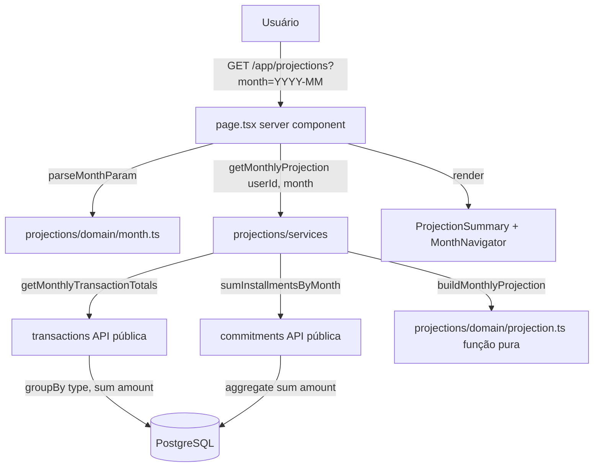

# Previsibilidade Mensal (`projections`) — Design

**Spec**: `.specs/features/projections/spec.md`
**Status**: Approved

---

## Architecture Overview

Abordagem escolhida (confirmada com o usuário): **consultas agregadas por mês vivem nos módulos donos** (`transactions` e `commitments`) e são expostas via suas APIs públicas; `projections` apenas compõe os agregados e aplica a fórmula do saldo em uma função pura de domínio. Nenhuma tabela nova, nenhuma migration — `projections` continua sem dados próprios (somente-leitura, AD-010).

A UI é 100% server components: o mês selecionado vive na URL (`?month=YYYY-MM`) e a navegação anterior/próximo/atual são `<Link>`s para a mesma página com outro `month`. Sem estado de cliente, sem JS interativo.



Fluxo por request: layout `/app` garante sessão (redirect `/login`, PROJ-08) → página valida `?month` com fallback UTC para o mês corrente (PROJ-01, 10, 11) → serviço busca os dois agregados em paralelo (`Promise.all`) → domínio compõe `MonthlyProjection` → componentes renderizam os 4 cards e a navegação.

---

## Code Reuse Analysis

### Existing Components to Leverage

| Component | Location | How to Use |
| --------- | -------- | ---------- |
| `Money`, `money()`, `addMoney`, `subtractMoney`, `formatBRL` | `src/shared/money.ts` | Toda aritmética/formatação dos agregados (AD-008); `saldoProjetado` pode ser negativo — verificar que `subtractMoney`/`money` aceitam negativos (ver Risks) |
| Guard de sessão do `/app` | `src/app/app/layout.tsx` | PROJ-08 já é atendido pelo layout existente; a página só resolve `userId` (padrão de `transactions/page.tsx`) |
| Padrão de page server component com `searchParams` | `src/app/app/transactions/page.tsx` | Mesmo esqueleto: `await props.searchParams`, sessão via `auth.api.getSession`, fetch paralelo |
| `Card`, `Button` (shadcn) | `src/shared` | Cards dos 4 agregados e botões/links de navegação |
| Grid de atalhos do app | `src/app/app/page.tsx` | Adicionar o 4º card "Projeções" (PROJ-18) |
| Padrão de repositório escopado por `userId` | `transactions/data`, `commitments/data` | As novas queries agregadas seguem a mesma assinatura `(userId, ...)` (AD-012) |
| Padrão de API pública via `index.ts` | todos os módulos | Novos exports em `transactions/index.ts`, `commitments/index.ts`, `projections/index.ts` (AD-010) |

### Integration Points

| System | Integration Method |
| ------ | ------------------ |
| `transactions` | Nova função de repositório `getMonthlyTransactionTotals(userId, month)` exportada na API pública — agregação no banco (`groupBy` por `type`, `_sum.amount`) |
| `commitments` | Nova função de repositório `sumInstallmentsByMonth(userId, month)` exportada na API pública — `aggregate` `_sum.amount` sobre `dueDate` no mês, qualquer status |
| Banco (Prisma) | Nenhuma mudança de schema. Filtro de mês por prefixo de string (`date`/`dueDate` são `String` `YYYY-MM-DD` zero-padded → `startsWith: "YYYY-MM-"` é correto e usa comparação lexicográfica) |
| Rotas | Nova página `src/app/app/projections/page.tsx` (paths em inglês, AD-014); link no grid de `/app` |

---

## Components

### 1. `getMonthlyTransactionTotals` (módulo `transactions`)

- **Purpose**: Totais de entradas e saídas avulsas de um usuário em um mês, agregados no banco.
- **Location**: `src/modules/transactions/data/transactions-repository.ts` (+ export em `index.ts`)
- **Interfaces**:
  - `getMonthlyTransactionTotals(userId: string, month: string): Promise<{ entradas: Money; saidas: Money }>` — `month` no formato `YYYY-MM` (já validado pelo chamador); `groupBy({ by: ["type"], where: { userId, date: { startsWith: month + "-" } }, _sum: { amount } })`; tipo ausente no resultado → `money(0)`.
- **Dependencies**: `prisma` (shared), `Money`.
- **Reuses**: padrão de repositório escopado por `userId` já existente no arquivo.
- **Requirements**: PROJ-02, PROJ-03(a), PROJ-15.

### 2. `sumInstallmentsByMonth` (módulo `commitments`)

- **Purpose**: Soma das parcelas (qualquer status) de um usuário com vencimento em um mês.
- **Location**: `src/modules/commitments/data/commitments-repository.ts` (+ export em `index.ts`)
- **Interfaces**:
  - `sumInstallmentsByMonth(userId: string, month: string): Promise<Money>` — `aggregate({ where: { userId, dueDate: { startsWith: month + "-" } }, _sum: { amount } })`; `_sum.amount ?? 0` → `money(0)` quando não há parcelas.
- **Dependencies**: `prisma`, `Money`.
- **Reuses**: padrão do repositório de commitments (denormalização de `userId` em `installment` já existe para exatamente este tipo de query, ver comentário no schema).
- **Requirements**: PROJ-03(b), PROJ-05, PROJ-15.

### 3. `projections/domain/month.ts`

- **Purpose**: Toda a lógica de mês-como-valor (`YYYY-MM`): validação do query param, navegação e formatação — pura, sem I/O.
- **Location**: `src/modules/projections/domain/month.ts`
- **Interfaces**:
  - `parseMonthParam(raw: string | undefined, now?: Date): string` — regex `^\d{4}-(0[1-9]|1[0-2])$` + ano 2000–2100; inválido/ausente → mês corrente derivado de `now` em UTC (default `new Date()`). Retorna sempre um `YYYY-MM` válido.
  - `previousMonth(month: string): string` / `nextMonth(month: string): string` — aritmética pura sobre ano/mês (sem `Date`, sem clamping de dia — não há dia envolvido).
  - `formatMonthLabel(month: string): string` — `"julho de 2026"` via `Intl.DateTimeFormat("pt-BR", { month: "long", year: "numeric", timeZone: "UTC" })`.
  - `getCurrentMonth(now?: Date): string` — mês corrente em UTC.
- **Dependencies**: nenhuma além de `Intl` nativo.
- **Reuses**: lição dos bugs de `addMonths` em commitments — tudo em UTC; aqui nem se usa `Date` para aritmética, só strings.
- **Requirements**: PROJ-01, PROJ-10, PROJ-11, PROJ-14.

### 4. `projections/domain/projection.ts` + `types.ts`

- **Purpose**: Fórmula da projeção como função pura sobre `Money` — o coração testável da feature.
- **Location**: `src/modules/projections/domain/`
- **Interfaces**:
  - `buildMonthlyProjection(input: { month: string; entradas: Money; saidasAvulsas: Money; parcelasDoMes: Money }): MonthlyProjection` — `saidasPrevistas = saidasAvulsas + parcelasDoMes`; `saldoProjetado = entradas − saidasPrevistas` (pode ser negativo); `totalComprometido = parcelasDoMes`.
- **Dependencies**: `addMoney`, `subtractMoney`, `money` (shared).
- **Reuses**: helpers de `Money` (AD-008).
- **Requirements**: PROJ-04, PROJ-05, PROJ-07, PROJ-13, PROJ-17.

### 5. `projections/services/get-monthly-projection.ts`

- **Purpose**: Orquestra os dois agregados e o domínio; único ponto de composição cross-módulo.
- **Location**: `src/modules/projections/services/get-monthly-projection.ts`
- **Interfaces**:
  - `getMonthlyProjection(userId: string, month: string): Promise<MonthlyProjection>` — `Promise.all([getMonthlyTransactionTotals, sumInstallmentsByMonth])` → `buildMonthlyProjection`.
- **Dependencies**: APIs públicas de `transactions` e `commitments` (imports via `index.ts`, AD-010); domínio de projections.
- **Reuses**: padrão de fetch paralelo de `transactions/page.tsx`.
- **Requirements**: PROJ-03, PROJ-15, PROJ-16 (testes de integração com 2 usuários vivem aqui).

### 6. Componentes de UI (`projections/components/`)

- **Purpose**: Apresentação dos 4 agregados e navegação de mês — server components puros (sem `"use client"`).
- **Location**: `src/modules/projections/components/`
- **Interfaces**:
  - `ProjectionSummary({ projection }: { projection: MonthlyProjection })` — 4 `Card`s: Entradas previstas, Saídas previstas, Saldo projetado, Total comprometido; valores via `formatBRL`; saldo negativo com classe de alerta (`text-destructive`) e sinal negativo (PROJ-06); mês zerado renderiza `R$ 0,00` sem alerta (PROJ-17).
  - `MonthNavigator({ month }: { month: string })` — links `?month=<previousMonth>` / `?month=<nextMonth>`, título `formatMonthLabel(month)`, e link "voltar ao mês atual" visível apenas quando `month !== getCurrentMonth()` (PROJ-09, PROJ-12, PROJ-14).
- **Dependencies**: `Card`, `Button`, `formatBRL` (shared); `next/link`; domínio de projections.
- **Reuses**: padrões visuais dos cards de `transactions`/`commitments`.
- **Requirements**: PROJ-06, PROJ-09, PROJ-12, PROJ-14, PROJ-17.

### 7. Página `src/app/app/projections/page.tsx`

- **Purpose**: Composição fina em `app/` — resolve sessão, valida `month`, chama o serviço, renderiza.
- **Location**: `src/app/app/projections/page.tsx`
- **Interfaces**: `default async function ProjectionsPage(props: { searchParams: Promise<{ month?: string }> })` (request APIs assíncronas, AD-013).
- **Dependencies**: `auth` (sessão), API pública de `projections`.
- **Reuses**: esqueleto de `transactions/page.tsx`; guard de sessão do layout `/app` (PROJ-08).
- **Requirements**: PROJ-01, PROJ-08, PROJ-10, PROJ-11.

### 8. API pública `projections/index.ts` + link em `/app`

- **Purpose**: Entry point único do módulo (AD-010) e descobribilidade (PROJ-18).
- **Location**: `src/modules/projections/index.ts`, `src/app/app/page.tsx`
- **Interfaces**: exporta `getMonthlyProjection`, `parseMonthParam`, `ProjectionSummary`, `MonthNavigator`, tipo `MonthlyProjection`. Grid de `/app` ganha o card "Projeções" (📈 → `/app/projections`), passando para 4 itens (`md:grid-cols-2 lg:grid-cols-4`).
- **Requirements**: PROJ-18.

---

## Data Models

Nenhuma mudança de schema (sem tabelas novas, sem migration). Tipo de domínio novo:

```typescript
// src/modules/projections/domain/types.ts
import type { Money } from "@/shared";

export type MonthlyProjection = {
  month: string; // YYYY-MM
  entradasPrevistas: Money;
  saidasPrevistas: Money; // avulsas + parcelas do mês
  saldoProjetado: Money; // entradas − saídas; pode ser negativo
  totalComprometido: Money; // soma das parcelas do mês (qualquer status)
};
```

**Relationships**: derivado on-the-fly de `Transaction` (via `transactions`) e `Installment` (via `commitments`); nunca persistido.

---

## Error Handling Strategy

| Error Scenario | Handling | User Impact |
| -------------- | -------- | ----------- |
| `?month` inválido (formato/range) | `parseMonthParam` cai no mês corrente, sem erro (PROJ-11) | Vê o mês atual normalmente |
| Sem sessão | Redirect do layout `/app` para `/login` (PROJ-08); página ainda lança `Unauthorized` se `userId` ausente (defesa em profundidade, padrão das outras páginas) | Vai para o login |
| Falha de query no banco | Propaga para o error boundary padrão do Next.js (sem estado parcial — leitura pura) | Página de erro padrão |
| Mês sem dados | Não é erro: agregações retornam `money(0)` e a UI renderiza `R$ 0,00` (PROJ-17) | Cards zerados, navegação ativa |

---

## Risks & Concerns

| Concern | Location (file:line) | Impact | Mitigation |
| ------- | -------------------- | ------ | ---------- |
| ~~`moneySchema` poderia rejeitar negativos~~ — **verificado: resolvido** | `src/shared/money/index.ts:6` | — | `moneySchema` é `z.number().int().finite()` sem `min(0)`: `subtractMoney` produz negativos e `formatBRL` formata com sinal via `Intl`. Unit test de saldo negativo cobre PROJ-06 mesmo assim |
| Índices são só `[userId]`; filtro de mês varre as linhas do usuário | `prisma/schema.prisma:147,184` | Degradação apenas com histórico muito grande; escala MVP ok | Aceitar no MVP; anotar índice composto `[userId, date]`/`[userId, dueDate]` como follow-up se a projeção ficar lenta |
| Filtro por prefixo de string depende do formato `YYYY-MM-DD` zero-padded | repositórios novos | Data fora do formato não entraria no mês | Formato já é garantido por Zod nos módulos donos na escrita; unit/integration tests cobrem fronteiras (dia 01 e último dia) |
| Grid de `/app` é hardcoded em 3 colunas | `src/app/app/page.tsx:21` | Layout quebra com o 4º card | Ajustar classes do grid na mesma task do link (PROJ-18) |

---

## Tech Decisions (only non-obvious ones)

| Decision | Choice | Rationale |
| -------- | ------ | --------- |
| Onde vivem as queries por mês | Nos módulos donos (`transactions`, `commitments`), expostas via API pública | Confirmado com o usuário; preserva ownership do schema e AD-010; agregação no banco (4 números, não N linhas) |
| Filtro de mês | `startsWith("YYYY-MM-")` sobre colunas string | Datas já são strings zero-padded; comparação lexicográfica é exata; evita conversões de timezone |
| UI sem client components | Navegação por `<Link href="?month=...">` em server components | Estado já vive na URL (spec); zero JS de estado; SSR direto |
| Aritmética de navegação de mês | Strings/inteiros puros em `month.ts`, sem objetos `Date` | Elimina a classe de bugs UTC/local que atingiu `addMonths` em commitments; só formatação usa `Intl` com `timeZone: "UTC"` |
| Novo AD proposto (AD-016) | Agregações cross-módulo sempre via API pública do módulo dono; consumidores nunca leem tabelas de outros módulos via Prisma | Vale também para o Dashboard (item 6); torna a regra da abordagem escolhida um padrão do projeto — registrar em STATE.md na aprovação deste design |
