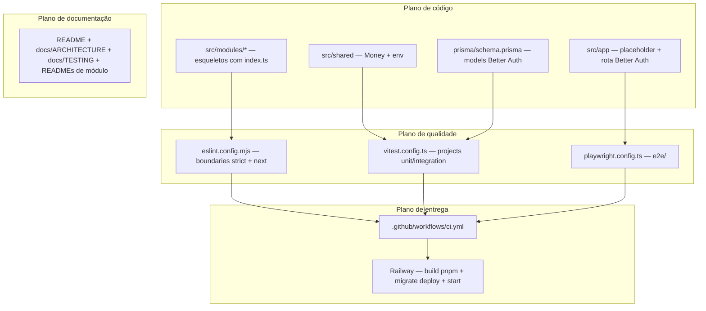
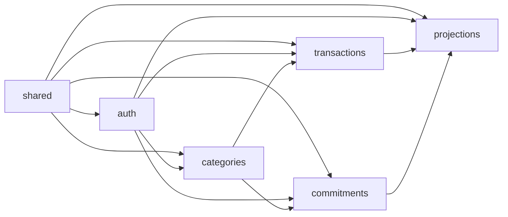

# Setup Design

**Spec**: `.specs/features/setup/spec.md`
**Context**: `.specs/features/setup/context.md`
**Status**: Approved

---

## Approach Exploration

A arquitetura de runtime já está travada por AD-001..AD-012 (monolito modular, Prisma, Zod, Better Auth, Railway) e pelo PROJECT.md (estrutura de pastas, grafo de módulos). O único ponto com alternativas reais era a linha do Next.js:

- **Next.js 16.x (escolhido, confirmado pelo usuário)** — Active LTS atual (GA out/2025). Turbopack como bundler padrão, `next lint` removido (ESLint configurado diretamente, o que já era necessário para o plugin de fronteiras), `proxy.ts` no lugar de `middleware.ts`, Node.js >= 20.9. Começa moderno, sem migração 15→16 pendente.
- Next.js 15.x — descartado: linha em manutenção, geraria migração obrigatória durante o MVP.

Registrado como AD-013 em `.specs/STATE.md`.

## Research Notes (Knowledge Verification Chain: web — codebase é greenfield)

- **Next.js 16**: sync `cookies()/headers()/params` removidos (sempre `await`); Turbopack padrão em dev e build; caching explícito. Nada disso afeta o placeholder, mas as convenções valem para todas as features futuras.
- **Better Auth + Prisma**: instância via `betterAuth({ database: prismaAdapter(prisma, { provider: "postgresql" }), emailAndPassword: { enabled: true } })`; schema gerado com `npx @better-auth/cli generate` (models `User`, `Session`, `Account`, `Verification` anexados ao `schema.prisma`); rota catch-all `app/api/auth/[...all]/route.ts` com `toNextJsHandler(auth)`. **Atenção**: o CLI do Better Auth espera o Prisma client no local padrão e a instância `auth` como named export — não usar `output` customizado no generator do Prisma.
- **eslint-plugin-boundaries >= 5.0**: compatível com ESLint 9 flat config. Config `strict` habilita `no-unknown-dependencies`/`no-unknown-files` → deny-by-default real (arquivo/módulo fora dos elementos declarados = erro), atendendo o edge case "novo módulo sem entrada na config falha por padrão".
- **Vitest 4**: `vitest.workspace.ts` foi removido; suítes separadas via `test.projects` no `vitest.config.ts`, filtradas com `--project unit` / `--project integration`.
- **Incerteza flagada**: versão exata do Node LTS a fixar (22 vs 24) e seu suporte no runtime do Railway — verificar no Execute (`node --version` disponível no builder do Railway) antes de gravar `.nvmrc`/`engines`. Mínimo duro: >= 20.9 (Next 16).

---

## Architecture Overview

O setup entrega quatro planos que se sustentam mutuamente:

Grafo de dependências entre módulos (reforçado pelo lint — AD-010):

(Leitura: seta A→B = "B pode importar A". `projections` é somente-leitura sobre `transactions`/`commitments`.)

---

## Code Reuse Analysis

Projeto greenfield — não há código a reutilizar. O reuso aqui é de **geradores e presets oficiais**, minimizando config artesanal:

| Recurso | Origem | Como usar |
| ------- | ------ | --------- |
| `create-next-app` | Next.js 16 | Scaffold base (TS, Tailwind, App Router, ESLint flat config) |
| `shadcn init` + componentes | shadcn/ui CLI | Tailwind theme + componentes do placeholder |
| `@better-auth/cli generate` | Better Auth | Gera models Prisma (User, Session, Account, Verification) |
| `@testcontainers/postgresql` | Testcontainers | Postgres descartável no setup global da suíte de integração |
| `boundaries.configs.strict` | eslint-plugin-boundaries | Base deny-by-default para as regras de fronteira |

### Integration Points

| Sistema | Método de integração |
| ------- | -------------------- |
| PostgreSQL (local/CI/Railway) | `DATABASE_URL` via env — única fonte de config (12-factor, AD-006) |
| GitHub Actions | `ci.yml` em push/PR para `main` |
| Railway | Build a partir de `main`; comando de start roda `prisma migrate deploy` antes de `next start` |

---

## Components

### 1. Scaffold Next.js + estrutura de módulos (SETUP-01)

- **Purpose**: Projeto Next.js 16 (App Router, TS strict, pnpm) com os 5 módulos + shared + e2e.
- **Location**: raiz, `src/modules/*`, `src/shared/`, `e2e/`
- **Interfaces**: cada módulo expõe apenas `index.ts` (vazio ou quase, com comentário do contrato) + `README.md`. Pastas `domain/ data/ services/ actions/ components/ __tests__/` criadas com `.gitkeep` onde vazias.
- **Dependencies**: Node LTS, pnpm.
- **Reuses**: `create-next-app`.

### 2. Lint de fronteiras (SETUP-02)

- **Purpose**: Tornar o grafo de módulos executável — violação quebra `pnpm lint`, build e CI.
- **Location**: `eslint.config.mjs`
- **Interfaces** (regras):
  - `boundaries/elements`: tipos `module` (`src/modules/*`), `module-internal`, `shared` (`src/shared/**`), `app` (`src/app/**`).
  - `boundaries/element-types` + `boundaries/dependencies` com `default: "disallow"` e policies espelhando o grafo AD-010.
  - `boundaries/no-private` / entry-point rule: import externo de módulo só via `index.ts`.
  - Preset `strict` → arquivos não classificados = erro (deny-by-default do edge case).
- **Dependencies**: ESLint 9 flat config, `eslint-plugin-boundaries@^5`, resolver TypeScript.
- **Reuses**: `boundaries.configs.strict`.

### 3. Persistência + Better Auth (SETUP-04, 05, 06)

- **Purpose**: Prisma conectado ao PostgreSQL com schema Better Auth migrado; instância auth funcional.
- **Location**: `prisma/schema.prisma`, `src/modules/auth/`
- **Interfaces**:
  - `src/modules/auth/domain/auth.ts`: `export const auth = betterAuth({ database: prismaAdapter(...), emailAndPassword: { enabled: true } })` — exposto via `src/modules/auth/index.ts`.
  - `src/app/api/auth/[...all]/route.ts`: `export const { GET, POST } = toNextJsHandler(auth)` — única linha de composição, sem lógica.
  - Prisma client singleton em `src/shared/db.ts` (padrão global para dev hot-reload), exposto via `src/shared/index.ts`.
  - `src/shared/env.ts`: schema Zod das env vars (`DATABASE_URL`, `BETTER_AUTH_SECRET`, `BETTER_AUTH_URL`); parse na inicialização → falha com mensagem clara (SETUP-06).
- **Dependencies**: `prisma`, `@prisma/client`, `better-auth`.
- **Reuses**: `@better-auth/cli generate` para os models.
- **Nota AC-2 (endpoint de prova)**: usar `GET /api/auth/ok` (endpoint `ok` embutido do Better Auth). Se a versão instalada não expuser `/ok`, usar outro endpoint GET embutido equivalente — o AC exige apenas provar que o handler está montado.

### 4. Money em shared (SETUP-07)

- **Purpose**: Único caminho para representar/operar/formatar dinheiro (AD-008).
- **Location**: `src/shared/money/`
- **Interfaces**:
  - `type Money` — branded type sobre `number` inteiro (centavos): `Brand<number, "Money">`.
  - `money(cents: number): Money` — construtor; rejeita não-inteiro/NaN/Infinity (Zod `z.number().int()`).
  - `moneySchema: z.ZodType<Money>` — para uso em contratos.
  - `addMoney(a, b): Money`, `subtractMoney(a, b): Money` — aritmética inteira.
  - `formatBRL(m: Money): string` — `Intl.NumberFormat("pt-BR", { style: "currency", currency: "BRL" })`.
- **Dependencies**: Zod. Zero dependências de Next/React/Prisma (regra 3 de fronteira).
- **Reuses**: `Intl.NumberFormat` nativo.

### 5. Pirâmide de testes (SETUP-08, 09, 10)

- **Purpose**: Três suítes prontas, cada uma no seu nível.
- **Location**: `vitest.config.ts`, `playwright.config.ts`, `e2e/`
- **Interfaces** (scripts pnpm):
  - `test:unit` → `vitest run --project unit` — include `src/**/__tests__/**/*.test.ts` (excl. `*.integration.test.ts`), sem banco.
  - `test:integration` → `vitest run --project integration` — include `src/**/*.integration.test.ts`; `globalSetup` decide: `DATABASE_URL` de teste definida → usa-a (CI); senão → sobe `@testcontainers/postgresql`, exporta a URL, roda `prisma migrate deploy`, derruba no teardown. Sem Docker e sem URL → erro com mensagem orientando as duas opções (edge case).
  - `test:e2e` → `playwright test` — `webServer` do Playwright builda/inicia produção (`next build && next start`) contra Postgres de teste; smoke: home → 200 + texto "Prumo".
- **Testes entregues no setup**: unit de Money (formatação, aritmética, rejeições); integração `shared/db` (conexão + tabelas Better Auth existem pós-migration); E2E smoke da home.
- **Dependencies**: `vitest@^4`, `@testcontainers/postgresql`, `@playwright/test`.
- **Reuses**: `test.projects` do Vitest 4; `webServer` do Playwright.

### 6. CI (SETUP-11)

- **Purpose**: Portão de qualidade antes de `main` → Railway.
- **Location**: `.github/workflows/ci.yml`
- **Interfaces** (jobs):
  1. `lint-typecheck`: `pnpm lint` + `pnpm typecheck` (`tsc --noEmit`).
  2. `unit`: `pnpm test:unit` (com cobertura).
  3. `integration`: service container `postgres:17` + `prisma migrate deploy` + `pnpm test:integration` (via `DATABASE_URL`).
  4. `e2e`: service container Postgres + `pnpm test:e2e` (Playwright builda e sobe produção); `actions/upload-artifact` do relatório em falha (`if: failure()`).
  5. `build`: `pnpm build`.
  - Jobs 1, 2 e 5 paralelos; 3 e 4 paralelos entre si. Setup comum: pnpm + cache + Node da `.nvmrc`.
- **Dependencies**: GitHub Actions (`actions/checkout`, `actions/setup-node`, `pnpm/action-setup`).

### 7. Deploy Railway (SETUP-12)

- **Purpose**: App no ar com migrations aplicadas antes de servir tráfego.
- **Location**: `railway.json` (ou config no painel documentada no README)
- **Interfaces**:
  - Build: `pnpm install --frozen-lockfile && pnpm build` (inclui `prisma generate` via `postinstall`).
  - Start: `pnpm start:prod` = `prisma migrate deploy && next start` — migration falhou → processo aborta, não serve tráfego (edge case).
  - Env: `DATABASE_URL` (referência ao Postgres gerenciado), `BETTER_AUTH_SECRET`, `BETTER_AUTH_URL`.
- **Dependencies**: serviço `prumo` + PostgreSQL criados no Railway (passo manual documentado no README; a verificação do AC é acessar a URL pública).

### 8. Placeholder com identidade (SETUP-03)

- **Purpose**: Home estática com nome, tagline e significado do Prumo.
- **Location**: `src/app/page.tsx` + componentes shadcn/ui usados
- **Interfaces**: página estática (sem acesso a banco — garante o edge case "home renderiza com banco fora do ar").
- **Reuses**: shadcn/ui (ex.: `Card`), tokens Tailwind.

### 9. Documentação (SETUP-13)

- **Purpose**: Regras do projeto descobríveis.
- **Location**: `README.md`, `docs/ARCHITECTURE.md`, `docs/TESTING.md`, `src/modules/*/README.md`, `src/shared/README.md`
- **Interfaces**: conteúdos exigidos pelos ACs da story P2 (badge de CI, grafo mermaid, 7 regras de fronteira, estratégia de testes, responsabilidade/API pública/dependências por módulo). README inclui os passos manuais: criação do projeto Railway e branch protection recomendada.

---

## Data Models

Nenhum model de negócio. O schema Prisma contém apenas os models gerados pelo Better Auth CLI:

- `User` (id, name, email, emailVerified, image, timestamps)
- `Session` (token, expiresAt, userId → User, ipAddress, userAgent)
- `Account` (providerId, accountId, userId → User, password para e-mail/senha, tokens OAuth nulos no MVP)
- `Verification` (identifier, value, expiresAt)

Aceitos como gerados (nomes/campos exatos podem variar com a versão do CLI); não customizar no setup.

`Money` é tipo de domínio TypeScript (branded number em centavos), não uma tabela.

---

## Error Handling Strategy

| Error Scenario | Handling | User Impact |
| -------------- | -------- | ----------- |
| Env var ausente/inválida no boot | Parse Zod em `shared/env.ts` falha com lista das vars faltantes | Processo não sobe; mensagem clara no log |
| `prisma migrate deploy` falha no Railway | `&&` no start aborta antes do `next start` | Deploy falha visível no Railway; versão anterior continua no ar |
| Integração sem Docker e sem `DATABASE_URL` | globalSetup lança erro orientando: "suba o Docker ou exporte DATABASE_URL" | Dev sabe exatamente o que fazer |
| Banco fora do ar em runtime | Home é estática e continua servindo; rotas de auth retornam erro da lib | Placeholder disponível; auth indisponível |
| Import ilegal entre módulos | Erro ESLint em dev (IDE) e no CI | Build/PR bloqueado com mensagem da regra violada |
| Money com não-inteiro | Construtor/schema Zod rejeita | Erro de validação explícito, nunca truncamento |

---

## Risks & Concerns

| Concern | Location | Impact | Mitigation |
| ------- | -------- | ------ | ---------- |
| Better Auth CLI falha com `output` customizado do Prisma client ou `auth` sem named export | `prisma/schema.prisma`, `src/modules/auth/domain/auth.ts` | `generate` não roda; schema não criado | Usar output padrão do Prisma client e `export const auth` (documentado em Research Notes) |
| Testcontainers exige Docker na máquina do dev | suíte de integração | Suíte falha em máquina sem Docker | Fallback por `DATABASE_URL` + erro orientativo (design do globalSetup) |
| Instância Better Auth importada por `src/app/api/auth/[...all]` cruza fronteira módulo→app | `eslint.config.mjs` | Falso positivo de lint | Policy explícita: `app` pode importar `module` via `index.ts` (app é camada de composição por definição) |
| E2E no CI precisa de schema migrado e env de auth | `ci.yml` | Flakiness/falha de pipeline | Job E2E roda `prisma migrate deploy` antes de iniciar o servidor; envs de teste fixas no workflow |
| Versão exata do Node LTS vs runtime Railway | `.nvmrc`, `engines` | Build falha no Railway se runtime divergir | Verificar no Execute e fixar a mesma versão em `.nvmrc`, `engines` e CI |

---

## Tech Decisions (only non-obvious ones)

| Decision | Choice | Rationale |
| -------- | ------ | --------- |
| Linha do Next.js | 16.x (AD-013) | Active LTS; evita migração 15→16 no meio do MVP; confirmado pelo usuário |
| Plugin de fronteiras | `eslint-plugin-boundaries@^5` preset `strict` | Deny-by-default nativo (arquivos não classificados = erro); flat config ESLint 9 |
| Suítes Vitest | `test.projects` (unit / integration) num único `vitest.config.ts` | Padrão Vitest 4 (workspace removido); filtragem por `--project` |
| Convenção de nomes de teste | `*.test.ts` = unit; `*.integration.test.ts` = integração; ambos em `__tests__/` do módulo | Separação por glob exigida pelos projects; documentada em TESTING.md |
| Postgres de integração | Testcontainers com fallback `DATABASE_URL` | Decisão do usuário (context.md) + modo CI (AD-011) |
| Migrations no deploy | `prisma migrate deploy && next start` no start command | Processo único (AD-006); aborta se migration falhar |
| Localização da instância Better Auth | `src/modules/auth` (não `src/lib`) | Regra de fronteira: auth é módulo de domínio; guias oficiais usam `lib/` mas isso violaria AD-010 |
| Prisma client | Singleton em `src/shared/db.ts`, output padrão | `shared` é importável por todos (AD-010); output padrão exigido pelo Better Auth CLI |

> Decisão promovida a projeto: **AD-013** (Next.js 16.x) registrada em `.specs/STATE.md`.
