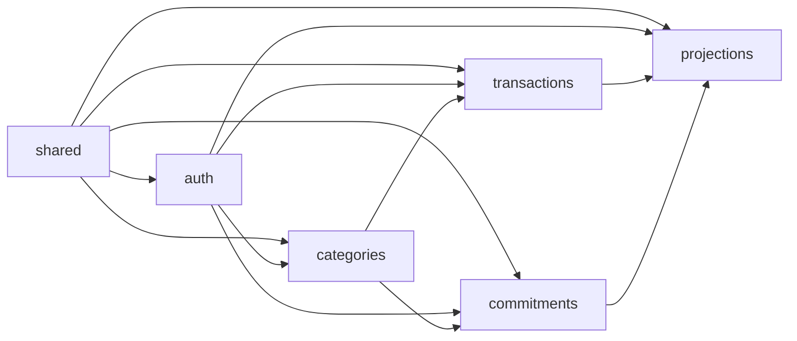
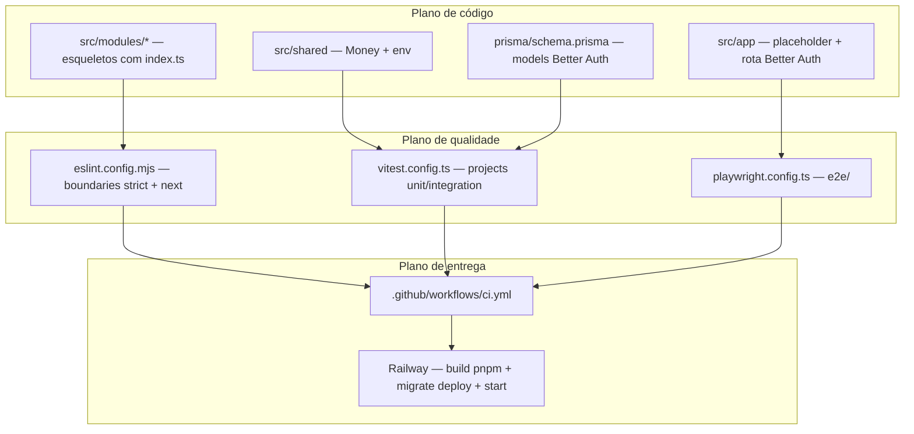

# Arquitetura

## Monolito modular

O Prumo é um único deployável (1 serviço Next.js no Railway) organizado internamente em módulos de domínio com fronteiras explícitas, reforçadas por lint (AD-001, AD-010). Cada módulo é dono do seu próprio domínio (regras de negócio, acesso a dados, casos de uso) e só expõe o que decide expor via `index.ts`.

### Módulos

- `auth` — identidade e sessão do usuário (Better Auth).
- `categories` — categorias de transações (padrão + personalizadas).
- `transactions` — entradas e saídas avulsas.
- `commitments` — compras parceladas e dívidas/financiamentos (pai + parcelas materializadas, AD-009).
- `projections` — previsibilidade mensal; **somente-leitura** sobre `transactions`/`commitments`.
- `shared` — kernel compartilhado (tipo `Money`, validação de env, Prisma client, componentes de UI genéricos). Não contém regra de negócio de nenhum domínio.

### Estrutura de pastas

```
src/
├── modules/
│   └── [modulo]/
│       ├── domain/        # tipos, schemas Zod, regras de negócio puras
│       ├── data/          # acesso a dados (repositórios usando Prisma)
│       ├── services/      # casos de uso (orquestram domain + data)
│       ├── actions/       # server actions (fronteira HTTP, valida com Zod)
│       ├── components/    # componentes React do módulo
│       ├── __tests__/     # testes unitários e de integração do módulo
│       └── index.ts       # API PÚBLICA do módulo (único ponto de import externo)
├── app/                   # rotas Next.js (App Router) — apenas composição, sem regra de negócio
└── shared/
e2e/                       # testes Playwright (fora de src/)
```

## Rotas

Rotas do App Router (`src/app`), apenas composição — sem regra de negócio (regra de fronteira #2).

### Páginas

| Rota | Arquivo | Módulo(s) consumido(s) |
| --- | --- | --- |
| `/` | `src/app/page.tsx` | — |
| `/login` | `src/app/login/page.tsx` | `auth` |
| `/signup` | `src/app/signup/page.tsx` | `auth` |
| `/terms` | `src/app/terms/page.tsx` | — |
| `/app` | `src/app/app/page.tsx` (layout: `src/app/app/layout.tsx`) | `auth`, `projections` |
| `/app/categories` | `src/app/app/categories/page.tsx` | `categories` |
| `/app/commitments` | `src/app/app/commitments/page.tsx` | `commitments` |
| `/app/transactions` | `src/app/app/transactions/page.tsx` | `transactions` |

### API

| Rota | Arquivo | Descrição |
| --- | --- | --- |
| `/api/auth/[...all]` | `src/app/api/auth/[...all]/route.ts` | Catch-all do Better Auth (login, sessão, etc.) |

Não há `middleware.ts` no projeto. Ao adicionar uma nova rota, atualize esta tabela.

## Grafo de dependências entre módulos



Leitura: seta A→B = "B pode importar A" (via `index.ts` de A). `shared` é a base do grafo, importável por todos; `projections` está no topo, somente-leitura sobre `transactions`/`commitments`, e não é importado por nenhum outro módulo de domínio.

## Regras de fronteira (invioláveis)

Reforçadas por `eslint-plugin-boundaries` (preset `strict`, configurado em `eslint.config.mjs` — T3) e registradas em AD-010 (`.specs/STATE.md`). Violação de qualquer regra abaixo quebra `pnpm lint`, o build e o CI:

1. Um módulo só importa de outro módulo através do `index.ts` (API pública) do outro. Import de arquivos internos de outro módulo (`domain/`, `data/`, `services/`, `actions/`, `components/`) é violação.
2. Regras de negócio vivem em `domain/` e `services/` — nunca em componentes React, rotas do App Router ou server actions.
3. `domain/` não importa Prisma, Next.js ou React: é TypeScript puro e testável isoladamente.
4. Componentes React nunca acessam o banco diretamente; sempre via `actions/`/`services/` do próprio módulo.
5. `projections` é um módulo somente-leitura: consome as APIs públicas de `transactions` e `commitments`, nunca escreve dados deles.
6. Dependências entre módulos devem ser acíclicas. Grafo permitido: `auth` ← (todos) | `categories` ← `transactions`, `commitments` | `transactions`, `commitments` ← `projections` | `shared` ← (todos).
7. Arquivo ou módulo fora dos elementos declarados na config de fronteiras (`module`, `shared`, `app`) falha por padrão (deny-by-default do preset `strict`) — um novo módulo só é permitido depois de ter uma entrada explícita no grafo.

## Planos que sustentam a arquitetura


